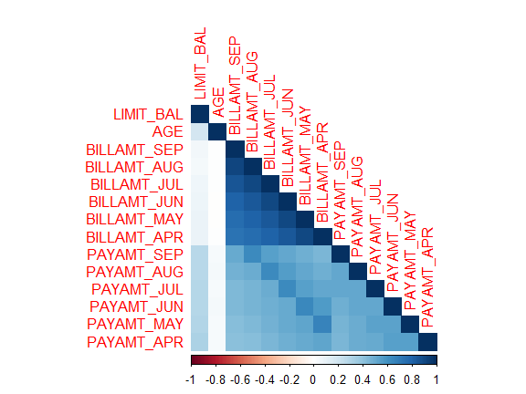
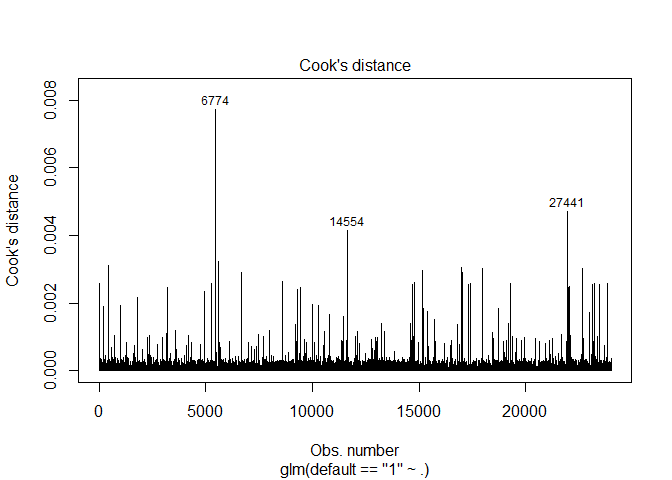
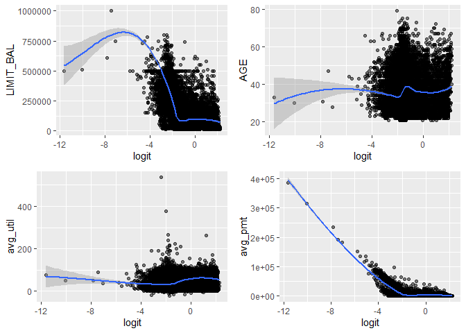

Binary Classification Using Logistic Regression Models
================

-   [1 Introduction](#1-introduction)
    -   [1.1 What is logistic regression and why is it used in
        classification
        problems?](#11-what-is-logistic-regression-and-why-is-it-used-in-classification-problems)
    -   [1.2 What are the assumptions needed for logistic
        regression?](#12-what-are-the-assumptions-needed-for-logistic-regression)
        -   [1.2(a) Type of logistic regression matches the response
            variable](#12a-type-of-logistic-regression-matches-the-response-variable)
        -   [1.2(b) Observations are
            independent](#12b-observations-are-independent)
        -   [1.2(c) No multicollinearity among explanatory
            variables](#12c-no-multicollinearity-among-explanatory-variables)
        -   [1.2(d) Linear relationship between continuous explanatory
            variables and logit of response
            variable](#12d-linear-relationship-between-continuous-explanatory-variables-and-logit-of-response-variable)
        -   [1.2(e) No highly influential
            outliers](#12e-no-highly-influential-outliers)
        -   [1.2(f) Large sample size](#12f-large-sample-size)
-   [2 Packages Required](#2-packages-required)
-   [3 Basics of Logistic Regression](#3-basics-of-logistic-regression)
    -   [3.1 Exploratory Data Analysis](#31-exploratory-data-analysis)
    -   [3.2 Building the Binary Logistic Regression
        Model](#32-building-the-binary-logistic-regression-model)
        -   [3.2(a) Testing Multicollinearity
            Assumption](#32a-testing-multicollinearity-assumption)
        -   [3.2(b) Testing Linearity
            Assumption](#32b-testing-linearity-assumption)
        -   [3.2(c) Checking for Highly Influential
            Outliers](#32c-checking-for-highly-influential-outliers)
    -   [3.3 Evaluating the Models](#33-evaluating-the-models)
        -   [Model 1: Full Model](#model-1-full-model)
        -   [Model 2: Restricted Model (Not
            Transformed)](#model-2-restricted-model-not-transformed)
        -   [Model 3: Restricted Model with
            Transformation](#model-3-restricted-model-with-transformation)
-   [4 Binary Classification Using Other Dataset With Out-of-Sample
    Evaluation](#4-binary-classification-using-other-dataset-with-out-of-sample-evaluation)
    -   [4.1 Dataset and Exploratory Data
        Analysis](#41-dataset-and-exploratory-data-analysis)
        -   [4.1.1 Univariate Plots](#411-univariate-plots)
        -   [4.1.2 Multivariate Plots](#412-multivariate-plots)
        -   [4.1.3 Creating New Variables](#413-creating-new-variables)
    -   [4.2 Building the Models](#42-building-the-models)
        -   [4.2.1 Full Model](#421-full-model)
        -   [4.2.2 Restricted Model](#422-restricted-model)
        -   [4.2.3 Checking for Influential Outliers in the Full
            Model](#423-checking-for-influential-outliers-in-the-full-model)
        -   [4.2.4 Checking Linearity Assumption of Full
            Model](#424-checking-linearity-assumption-of-full-model)
        -   [4.2.5 Evaluating the Performance of the Full
            Model](#425-evaluating-the-performance-of-the-full-model)
    -   [4.3 Stepwise Model Using Backward
        Elimination](#43-stepwise-model-using-backward-elimination)
        -   [4.3.1 Creating the Model](#431-creating-the-model)
        -   [4.3.2 Evaluating the Stepwise
            Model](#432-evaluating-the-stepwise-model)
    -   [4.4 LASSO Logistic Model](#44-lasso-logistic-model)
        -   [4.4.1 Converting Data Frame to
            Matrix](#441-converting-data-frame-to-matrix)
        -   [4.4.2 Calculating lambda](#442-calculating-lambda)
        -   [4.4.3 Fitting the LASSO Logistic
            Model](#443-fitting-the-lasso-logistic-model)
        -   [4.4.4 Evaluating the LASSO Logistic
            Model](#444-evaluating-the-lasso-logistic-model)
-   [5 Final Remarks](#5-final-remarks)
-   [References](#references)

# 1 Introduction

The purpose of this project was to apply what I had learnt about
logistic regression and classification in machine learning (ML). It
documents (1) the packages and functions that are useful for logistic
classification and ML, and (2) the steps to building a logistic
classification model in R.

The project has three main parts. In the first part, I introduced what
logistic regression is and why it is used in classification in machine
learning. In the second part, I provided examples of logistic regression
in binary classification (i.e. there are only two outcomes) using an
in-built dataset in R. In the last part, I applied the logistic
regression along with more practical approaches to variable selection on
a separate dataset.

This project focused on how to use logistic regression models in binary
classification, and less about the mathematical application and theory
behind it as these can be found on various websites and textbooks.

## 1.1 What is logistic regression and why is it used in classification problems?

Logistic regression is commonly used to determine the relationship
between binary outcomes and one or more independent variables. The
logistic regression model is written as

}{1-p(y=1)}\bigg) = \beta_0 + \beta_1x_1 + \beta_2x_2 + ... + \beta_nx_n
")

and shows a linear relationship between the independent variables and
the log-odds (or logit), where the odds refers to
.
The independent variables can be categorical or continuous variables.
The dependent variable has only two outcomes (in general), for example
yes or no, male or female, default or no default.

The coefficients of the independent variables can be interpreted as the
effect of an increase in

on the log-odds. The probability where
can
also be obtained through some mathematical operations, though this can
be done automatically in R. By setting a cut-off probability or
threshold value, we can classify whether an observation is likely to
fall under

or
.

Logistic regression can be simple to understand and interpret, although
it may not be the best classification model in comparison to more
sophisticated ML algorithms.

## 1.2 What are the assumptions needed for logistic regression?

This sub-section lists the common assumptions of logistic regressions
and some of the ways to check them.

### 1.2(a) Type of logistic regression matches the response variable

The type of logit regression needs to match the type of outcome. In most
cases, logit regression is used for binary outcomes but there are cases
where it might be used for multinomial or ordinal outcomes and
appropriate models need to be used for each type.

**To check assumption**: Check the number of unique outcomes/response
variable. If there are only two outcomes, it is very likely to be a
binary classification problem. If there are more than two outcomes, we
are dealing with multinomial or ordinal classification problems.

### 1.2(b) Observations are independent

Observations need to be independent of one another, and not be affected
by other observations.

**To check assumption**: Plot the residuals against order of
observations and check if there is a random pattern. If pattern is not
random, it indicates possibility of correlation between observations.
However, autocorrelation should be less of a concern with
cross-sectional data as long as the design of the study ensures that
data are collected from random samples and there are no repeated or
paired observations.

### 1.2(c) No multicollinearity among explanatory variables

Independent variables should not be highly correlated with one another
as it affects the variance of estimated coefficients and statistical
significance of estimated coefficients becomes unreliable.

**To check assumption**: A simple method would be to use a correlation
matrix to find highly correlated explanatory variables. Another method
is to calculate the variance inflation factor (VIF) of each explanatory
variable. A common rule of thumb is that VIF more than 10 indicates
problem of multicollinearity.

### 1.2(d) Linear relationship between continuous explanatory variables and logit of response variable

Continuous explanatory variables and the logit of the response variable
(or log-odds) have a linear relationship. Logit regression does not
require linearity between continuous explanatory variables and response
variable.

**To check assumption**: Plot log-odds against each continuous
explanatory variable and check for linear relationship

### 1.2(e) No highly influential outliers

There should be no influential outliers that could affect the outcome of
the model. Removing such observations are possible if they are
determined to be incorrectly entered or measured. It is also possible to
compare the regression results with and without the outliers, and note
how the results differ.

**To check assumption**: Calculate Cook’s Distance to find influential
observations and standardized residuals to find outliers.

### 1.2(f) Large sample size

A large sample size is needed to produce conclusive results.

# 2 Packages Required

``` r
# Use install.packages("packagename") if the packages are not installed in R
library(car) 
library(caret) # For building ML models
library(corrplot) # For correlation plot
library(tidyverse) # For ggplot and dplyr packages
library(mlbench) # For data sets
library(lmtest) # For statistical tests
library(glmnet) # For LASSO logistic regression
```

These packages provide the necessary functions and data sets that can be
used for learning and building logistic classification models.

# 3 Basics of Logistic Regression

This section covers how to perform logistic regression and solve binary
classification problems using an in-built dataset.

I selected the Pima Indians Diabetes Database in the **`mlbench`**
package for this example. The purpose is to determine the probability of
a person having diabetes based on several variables such as the person’s
body mass index, age, and blood pressure.

## 3.1 Exploratory Data Analysis

Let us first load the data and perform an Exploratory Data Analysis
before the modelling task.

``` r
data("PimaIndiansDiabetes")
```

``` r
str(PimaIndiansDiabetes)
```

    ## 'data.frame':    768 obs. of  9 variables:
    ##  $ pregnant: num  6 1 8 1 0 5 3 10 2 8 ...
    ##  $ glucose : num  148 85 183 89 137 116 78 115 197 125 ...
    ##  $ pressure: num  72 66 64 66 40 74 50 0 70 96 ...
    ##  $ triceps : num  35 29 0 23 35 0 32 0 45 0 ...
    ##  $ insulin : num  0 0 0 94 168 0 88 0 543 0 ...
    ##  $ mass    : num  33.6 26.6 23.3 28.1 43.1 25.6 31 35.3 30.5 0 ...
    ##  $ pedigree: num  0.627 0.351 0.672 0.167 2.288 ...
    ##  $ age     : num  50 31 32 21 33 30 26 29 53 54 ...
    ##  $ diabetes: Factor w/ 2 levels "neg","pos": 2 1 2 1 2 1 2 1 2 2 ...

``` r
summary(PimaIndiansDiabetes)
```

    ##     pregnant         glucose         pressure         triceps     
    ##  Min.   : 0.000   Min.   :  0.0   Min.   :  0.00   Min.   : 0.00  
    ##  1st Qu.: 1.000   1st Qu.: 99.0   1st Qu.: 62.00   1st Qu.: 0.00  
    ##  Median : 3.000   Median :117.0   Median : 72.00   Median :23.00  
    ##  Mean   : 3.845   Mean   :120.9   Mean   : 69.11   Mean   :20.54  
    ##  3rd Qu.: 6.000   3rd Qu.:140.2   3rd Qu.: 80.00   3rd Qu.:32.00  
    ##  Max.   :17.000   Max.   :199.0   Max.   :122.00   Max.   :99.00  
    ##     insulin           mass          pedigree           age        diabetes 
    ##  Min.   :  0.0   Min.   : 0.00   Min.   :0.0780   Min.   :21.00   neg:500  
    ##  1st Qu.:  0.0   1st Qu.:27.30   1st Qu.:0.2437   1st Qu.:24.00   pos:268  
    ##  Median : 30.5   Median :32.00   Median :0.3725   Median :29.00            
    ##  Mean   : 79.8   Mean   :31.99   Mean   :0.4719   Mean   :33.24            
    ##  3rd Qu.:127.2   3rd Qu.:36.60   3rd Qu.:0.6262   3rd Qu.:41.00            
    ##  Max.   :846.0   Max.   :67.10   Max.   :2.4200   Max.   :81.00

``` r
head(PimaIndiansDiabetes, n = 4)
```

    ##   pregnant glucose pressure triceps insulin mass pedigree age diabetes
    ## 1        6     148       72      35       0 33.6    0.627  50      pos
    ## 2        1      85       66      29       0 26.6    0.351  31      neg
    ## 3        8     183       64       0       0 23.3    0.672  32      pos
    ## 4        1      89       66      23      94 28.1    0.167  21      neg

``` r
tail(PimaIndiansDiabetes, n = 4)
```

    ##     pregnant glucose pressure triceps insulin mass pedigree age diabetes
    ## 765        2     122       70      27       0 36.8    0.340  27      neg
    ## 766        5     121       72      23     112 26.2    0.245  30      neg
    ## 767        1     126       60       0       0 30.1    0.349  47      pos
    ## 768        1      93       70      31       0 30.4    0.315  23      neg

By entering `??PimaIndiansDiabetes` into the console, we can get a
description of the variables in the data frame. I have listed the
variables and its description in the table below.

| Variable | Description                                           |
|----------|-------------------------------------------------------|
| pregnant | Number of times pregnant                              |
| glucose  | Plasma glucose concentration (glucose tolerance test) |
| pressure | Diastolic blood pressure (mm Hg)                      |
| triceps  | Triceps skin fold thickness (mm)                      |
| insulin  | 2-Hour serum insulin (mu U/ml)                        |
| mass     | Body mass index (weight in kg/(height in m)^2)        |
| pedigree | Diabetes pedigree function                            |
| age      | Age (years)                                           |
| diabetes | Class variable (test for diabetes)                    |

The **`str`** function shows that there are 768 observations with 9
variables and only the variable *`diabetes`* is a factor while all other
variables are numeric.

The **`summary`** function reveals that there are possibly some errors
in the data, with value of zero in variables *`glucose`*, *`pressure`*,
*`triceps`*, and *`mass`*. I would remove these observations to keep
things simple. The imputation of these variables would require methods
beyond using the mean or median of each variable.

``` r
data <- PimaIndiansDiabetes %>%
  dplyr::filter(glucose != 0 & pressure != 0 & triceps != 0 & mass != 0)

summary(data)
```

    ##     pregnant         glucose          pressure         triceps     
    ##  Min.   : 0.000   Min.   : 56.00   Min.   : 24.00   Min.   : 7.00  
    ##  1st Qu.: 1.000   1st Qu.: 98.75   1st Qu.: 64.00   1st Qu.:22.00  
    ##  Median : 2.000   Median :115.00   Median : 72.00   Median :29.00  
    ##  Mean   : 3.517   Mean   :121.03   Mean   : 71.51   Mean   :29.18  
    ##  3rd Qu.: 5.000   3rd Qu.:141.25   3rd Qu.: 80.00   3rd Qu.:36.00  
    ##  Max.   :17.000   Max.   :199.00   Max.   :110.00   Max.   :99.00  
    ##     insulin           mass          pedigree           age        diabetes 
    ##  Min.   :  0.0   Min.   :18.20   Min.   :0.0850   Min.   :21.00   neg:355  
    ##  1st Qu.:  0.0   1st Qu.:27.88   1st Qu.:0.2587   1st Qu.:23.00   pos:177  
    ##  Median : 91.5   Median :32.80   Median :0.4160   Median :28.00            
    ##  Mean   :115.0   Mean   :32.89   Mean   :0.5030   Mean   :31.61            
    ##  3rd Qu.:165.2   3rd Qu.:36.90   3rd Qu.:0.6585   3rd Qu.:38.00            
    ##  Max.   :846.0   Max.   :67.10   Max.   :2.4200   Max.   :81.00

It seems that *`insulin`* has values of zero as well, which could be due
to not receiving insulin despite having diabetes. Removing these
observations might impact the results and analysis.

Now that there is a better understanding of the variables in the
dataset, I would plot these variables to visualize their distribution.

``` r
response <- subset(data, select = c(diabetes))

explvar <- subset(data, select = -c(diabetes))

summary(response)
```

    ##  diabetes 
    ##  neg:355  
    ##  pos:177

``` r
summary(explvar)
```

    ##     pregnant         glucose          pressure         triceps     
    ##  Min.   : 0.000   Min.   : 56.00   Min.   : 24.00   Min.   : 7.00  
    ##  1st Qu.: 1.000   1st Qu.: 98.75   1st Qu.: 64.00   1st Qu.:22.00  
    ##  Median : 2.000   Median :115.00   Median : 72.00   Median :29.00  
    ##  Mean   : 3.517   Mean   :121.03   Mean   : 71.51   Mean   :29.18  
    ##  3rd Qu.: 5.000   3rd Qu.:141.25   3rd Qu.: 80.00   3rd Qu.:36.00  
    ##  Max.   :17.000   Max.   :199.00   Max.   :110.00   Max.   :99.00  
    ##     insulin           mass          pedigree           age       
    ##  Min.   :  0.0   Min.   :18.20   Min.   :0.0850   Min.   :21.00  
    ##  1st Qu.:  0.0   1st Qu.:27.88   1st Qu.:0.2587   1st Qu.:23.00  
    ##  Median : 91.5   Median :32.80   Median :0.4160   Median :28.00  
    ##  Mean   :115.0   Mean   :32.89   Mean   :0.5030   Mean   :31.61  
    ##  3rd Qu.:165.2   3rd Qu.:36.90   3rd Qu.:0.6585   3rd Qu.:38.00  
    ##  Max.   :846.0   Max.   :67.10   Max.   :2.4200   Max.   :81.00

Let us take a look at the distribution of the response and explvar
variables in a univariate plot. This gives us a visual understanding of
how the variables are distributed individually.

``` r
ggplot(data = response) + 
  geom_bar(aes(x = diabetes, fill = diabetes)) + 
  ggtitle("Distribution of Outcomes from Diabetes Test") +
  xlab("Diabetes") + ylab("Frequency") +
  theme(plot.title = element_text(hjust = 0.5))
```


We have about twice as many negative observations compared to positive
observations. While this may not be a problem in our case, it would be
good to think about the representation of observations in a more complex
dataset. Under-representation of any group in an analysis may lead to
unreliable results and analysis.

``` r
par(mfrow = c(1, 4), mar = c(1, 3, 2, 1))

for (i in 1:4) {
  boxplot(explvar[,i], main = names(explvar)[i])
}
```


``` r
for (i in 5:8) {
  boxplot(explvar[,i], main = names(explvar)[i])
}
```


Plotting the explanatory variables using histograms allow us to visually
check how the data is distributed. The plots show that most variables do
not have a normal distribution, which we can further check with the
Shapiro-Wilk’s test.

``` r
par(mfrow = c(1, 4), mar = c(2, 3, 2, 1))

for (i in 1:4) {
  hist(explvar[,i], main = names(explvar)[i])
}
```


``` r
for (i in 5:8) {
  hist(explvar[,i], main = names(explvar)[i])
}
```


``` r
store_test <- list()

for (i in 1:8) {
  store_test <- cbind(store_test, 
                      shapiro.test(x = explvar[,i]))
}

store_test["data.name",] <- names(explvar)

store_test
```

    ##           [,1]                          [,2]                         
    ## statistic 0.872964                      0.9578421                    
    ## p.value   2.031706e-20                  3.345494e-11                 
    ## method    "Shapiro-Wilk normality test" "Shapiro-Wilk normality test"
    ## data.name "pregnant"                    "glucose"                    
    ##           [,3]                          [,4]                         
    ## statistic 0.9897135                     0.9679037                    
    ## p.value   0.0008825611                  2.177388e-09                 
    ## method    "Shapiro-Wilk normality test" "Shapiro-Wilk normality test"
    ## data.name "pressure"                    "triceps"                    
    ##           [,5]                          [,6]                         
    ## statistic 0.8190614                     0.9775756                    
    ## p.value   5.138553e-24                  2.782579e-07                 
    ## method    "Shapiro-Wilk normality test" "Shapiro-Wilk normality test"
    ## data.name "insulin"                     "mass"                       
    ##           [,7]                          [,8]                         
    ## statistic 0.8447408                     0.8539208                    
    ## p.value   2.022287e-22                  8.407239e-22                 
    ## method    "Shapiro-Wilk normality test" "Shapiro-Wilk normality test"
    ## data.name "pedigree"                    "age"

``` r
store_test["p.value",] > 0.05
```

    ## [1] FALSE FALSE FALSE FALSE FALSE FALSE FALSE FALSE

We can use multivariate plots to visualize how variables interact with
one another. Using a correlation matrix heatmap, we can visualize the
correlation between variables and check for the presence of
multicollinearity between explanatory variables. Since the
Shapiro-Wilk’s test rejected the hypothesis of normal distribution for
the explanatory variables, I would use the Spearman correlation instead
of Pearson correlation.

``` r
corrX <- cor(x = explvar, method = "spearman")

corrplot(corr = corrX, 
         method = "color", 
         addCoef.col = "black",
         title = "Correlation Between Explanatory Variables",
         mar = c(0, 0, 1, 0))
```


From the correlation matrix, there does not seem to be any highly
correlated explanatory variables, which may satisfy our assumption that
there is no multicollinearity.

Now that we have a better understanding of the variables in the dataset,
we can proceed with the modelling process.

## 3.2 Building the Binary Logistic Regression Model

To start off, we can create a logistic regression model that uses all
the explanatory variables. We need to use the **`glm`** function and for
the **`family`** argument, we indicate `binomial(link = "logit")` for
logistic regression.

``` r
# Full model
model1 <- glm(diabetes == "pos" ~ ., #indicate "pos" so that it is 1 and "neg" is 0
              data = data, 
              family = binomial(link = "logit"))

summary(model1)
```

    ## 
    ## Call:
    ## glm(formula = diabetes == "pos" ~ ., family = binomial(link = "logit"), 
    ##     data = data)
    ## 
    ## Deviance Residuals: 
    ##     Min       1Q   Median       3Q      Max  
    ## -2.8627  -0.6639  -0.3672   0.6347   2.4942  
    ## 
    ## Coefficients:
    ##              Estimate Std. Error z value Pr(>|z|)    
    ## (Intercept) -9.677562   1.005400  -9.626  < 2e-16 ***
    ## pregnant     0.121235   0.043926   2.760 0.005780 ** 
    ## glucose      0.037439   0.004765   7.857 3.92e-15 ***
    ## pressure    -0.009316   0.010446  -0.892 0.372494    
    ## triceps      0.006341   0.014853   0.427 0.669426    
    ## insulin     -0.001053   0.001007  -1.046 0.295651    
    ## mass         0.085992   0.023661   3.634 0.000279 ***
    ## pedigree     1.335764   0.365771   3.652 0.000260 ***
    ## age          0.026430   0.013962   1.893 0.058371 .  
    ## ---
    ## Signif. codes:  0 '***' 0.001 '**' 0.01 '*' 0.05 '.' 0.1 ' ' 1
    ## 
    ## (Dispersion parameter for binomial family taken to be 1)
    ## 
    ##     Null deviance: 676.79  on 531  degrees of freedom
    ## Residual deviance: 465.23  on 523  degrees of freedom
    ## AIC: 483.23
    ## 
    ## Number of Fisher Scoring iterations: 5

The coefficients (or “Estimate” in the regression output) of the
explanatory variables refers to the effect on the log-odds and not the
probability itself.

Variables *`pressure`*, *`triceps`*, *`insulin`*, and *`age`* has
p-values more than the significance level of 5%. We may consider
removing them from the equation and see if we get better results. The
Likelihood Ratio test will be needed to test if the difference is
significant, which is something like an F-test for Ordinary Least
Squares regression models. The null hypothesis is that the full model
and the restricted model fits the data equally well and we should use
the restricted model. The alternative is to use the full model.

``` r
# Restricted model
model2 <- glm(diabetes == "pos" ~ pregnant + glucose + mass + pedigree, 
              data = data,
              family = binomial(link = "logit"))

summary(model2)
```

    ## 
    ## Call:
    ## glm(formula = diabetes == "pos" ~ pregnant + glucose + mass + 
    ##     pedigree, family = binomial(link = "logit"), data = data)
    ## 
    ## Deviance Residuals: 
    ##     Min       1Q   Median       3Q      Max  
    ## -3.0663  -0.6606  -0.3794   0.6282   2.5214  
    ## 
    ## Coefficients:
    ##              Estimate Std. Error z value Pr(>|z|)    
    ## (Intercept) -9.449410   0.874874 -10.801  < 2e-16 ***
    ## pregnant     0.172876   0.034474   5.015 5.31e-07 ***
    ## glucose      0.036482   0.004136   8.822  < 2e-16 ***
    ## mass         0.084232   0.018089   4.657 3.21e-06 ***
    ## pedigree     1.361746   0.361589   3.766 0.000166 ***
    ## ---
    ## Signif. codes:  0 '***' 0.001 '**' 0.01 '*' 0.05 '.' 0.1 ' ' 1
    ## 
    ## (Dispersion parameter for binomial family taken to be 1)
    ## 
    ##     Null deviance: 676.79  on 531  degrees of freedom
    ## Residual deviance: 470.30  on 527  degrees of freedom
    ## AIC: 480.3
    ## 
    ## Number of Fisher Scoring iterations: 5

``` r
lmtest::lrtest(model2, model1)
```

    ## Likelihood ratio test
    ## 
    ## Model 1: diabetes == "pos" ~ pregnant + glucose + mass + pedigree
    ## Model 2: diabetes == "pos" ~ pregnant + glucose + pressure + triceps + 
    ##     insulin + mass + pedigree + age
    ##   #Df  LogLik Df  Chisq Pr(>Chisq)
    ## 1   5 -235.15                     
    ## 2   9 -232.62  4 5.0663     0.2806

Since the **`lrtest`** function returned a p-value more than 5%, we do
not reject the null and hence, we will use the restricted model for our
analysis.

### 3.2(a) Testing Multicollinearity Assumption

In Section 3.1 Exploratory Data Analysis, I used the correlation matrix
to determine if there are any highly correlated explanatory variables.
Another method is to use the Variance Inflation Factor.

``` r
car::vif(model2)
```

    ## pregnant  glucose     mass pedigree 
    ## 1.033636 1.011338 1.026758 1.013449

None of the variables has a VIF of more than 10. Therefore, it is likely
that there is no multicollinearity among the explanatory variables.

### 3.2(b) Testing Linearity Assumption

To check if there is a linear relationship between the continuous
explanatory variables and the logit of the response variable, we need to
obtain the fitted probabilities from our model. The **`fitted.values`**
function returns the probability and not the log-odds.

``` r
prob.model2 <- fitted.values(model2)

head(prob.model2)
```

    ##          1          2          4          5          7          9 
    ## 0.66178457 0.03056138 0.03121139 0.90844224 0.04163681 0.70424815

``` r
pred <- names(coef(model2)[-1]) # Exclude intercept

plotdata <- subset(data, select = pred) # Only keep the variables used in the model

plotdata <- plotdata %>%
  mutate(logit = log(prob.model2/(1-prob.model2))) %>% # Bind logit to plotdata
  gather(key = "pred", value = "pred.value", -logit) 
```

``` r
ggplot(data = plotdata, aes(x = logit, y = pred.value)) +
  geom_point(alpha = 0.7) +
  geom_smooth(method = "loess") +
  facet_wrap(. ~ pred, scales = "free")
```


We can see that variables *`glucose`*, *`mass`* and *`pregnant`* are
have a rather linear relationship, but *`pedigree`* has a non-linear
relationship with the log-odds. I have attempted to transform the
variable using the natural log.

``` r
model3 <- glm(diabetes == "pos" ~ pregnant + glucose + mass + log(pedigree),
              data = data,
              family = binomial(link = "logit"))

summary(model3)
```

    ## 
    ## Call:
    ## glm(formula = diabetes == "pos" ~ pregnant + glucose + mass + 
    ##     log(pedigree), family = binomial(link = "logit"), data = data)
    ## 
    ## Deviance Residuals: 
    ##     Min       1Q   Median       3Q      Max  
    ## -2.6727  -0.6591  -0.3719   0.6082   2.5468  
    ## 
    ## Coefficients:
    ##                Estimate Std. Error z value Pr(>|z|)    
    ## (Intercept)   -8.058222   0.841118  -9.580  < 2e-16 ***
    ## pregnant       0.174143   0.034585   5.035 4.77e-07 ***
    ## glucose        0.036348   0.004139   8.782  < 2e-16 ***
    ## mass           0.083830   0.018145   4.620 3.84e-06 ***
    ## log(pedigree)  0.789899   0.194017   4.071 4.68e-05 ***
    ## ---
    ## Signif. codes:  0 '***' 0.001 '**' 0.01 '*' 0.05 '.' 0.1 ' ' 1
    ## 
    ## (Dispersion parameter for binomial family taken to be 1)
    ## 
    ##     Null deviance: 676.79  on 531  degrees of freedom
    ## Residual deviance: 467.55  on 527  degrees of freedom
    ## AIC: 477.55
    ## 
    ## Number of Fisher Scoring iterations: 5

``` r
prob.model3 <- fitted.values(model3)

logit = log(prob.model3/(1-prob.model3))
```

``` r
plotdata2 <- subset(data, select = pred)

plotdata2 <- plotdata2 %>%
  mutate(l.pedigree = log(pedigree))
```

``` r
ggplot(data = plotdata2, aes(x = logit, y = l.pedigree)) +
  geom_point(alpha = 0.7) +
  geom_smooth(method = "loess")
```

    ## `geom_smooth()` using formula 'y ~ x'


After the log transformation, *`pedigree`* has a more linear
relationship with the log-odds compared to before.

### 3.2(c) Checking for Highly Influential Outliers

This requires that we find outliers that are highly influential. To
determine the observations that have the highest influence, we can plot
the Cook’s Distance generated from the model or calculate them using
**`cooks.distance`** function. To determine the outliers, we use the
standardized residuals and check if there are any observations with
absolute values greater than 3. We can also use the **`outlierTest`**
function in the **`car`** package to calculate the studentized
residuals.

``` r
plot(model3, which = 4)
```

<!-- -->

``` r
head(sort(cooks.distance(model3), decreasing = T))
```

    ##        229        745        674        488        248        329 
    ## 0.04174376 0.03862074 0.03089600 0.02363129 0.02148044 0.02040472

``` r
std.resid <- rstandard(model3)

val <- abs(std.resid) > 3

table(val)["TRUE"] # Returned NA because there are no TRUE logical values
```

    ## <NA> 
    ##   NA

``` r
car::outlierTest(model3)
```

    ## No Studentized residuals with Bonferroni p < 0.05
    ## Largest |rstudent|:
    ##      rstudent unadjusted p-value Bonferroni p
    ## 229 -2.711258          0.0067028           NA

I had found no outliers that were highly influential based on the tests
that were conducted. If outliers were found, instead of removing them,
it is better to investigate these observations to check if they were
erroneously measured or recorded.

## 3.3 Evaluating the Models

Now that we have created a few models, we can evaluate how each model
performs in predicting the in-sample observations. We first store the
fitted values of different models and I will set the cutoff at 0.5 to
determine whether an observation would be positive or negative to make
things simple for now.

### Model 1: Full Model

``` r
prob.model1 <- fitted.values(model1) #can also use predict(model1, type="response")
```

``` r
prediction.model1 <- as.factor(ifelse(prob.model1 > 0.5, "pos", "neg"))

confusionMatrix(data$diabetes,
                prediction.model1,
                dnn = c("Actual", "Predicted"))
```

    ## Confusion Matrix and Statistics
    ## 
    ##       Predicted
    ## Actual neg pos
    ##    neg 316  39
    ##    pos  76 101
    ##                                           
    ##                Accuracy : 0.7838          
    ##                  95% CI : (0.7464, 0.8181)
    ##     No Information Rate : 0.7368          
    ##     P-Value [Acc > NIR] : 0.0070667       
    ##                                           
    ##                   Kappa : 0.4862          
    ##                                           
    ##  Mcnemar's Test P-Value : 0.0007879       
    ##                                           
    ##             Sensitivity : 0.8061          
    ##             Specificity : 0.7214          
    ##          Pos Pred Value : 0.8901          
    ##          Neg Pred Value : 0.5706          
    ##              Prevalence : 0.7368          
    ##          Detection Rate : 0.5940          
    ##    Detection Prevalence : 0.6673          
    ##       Balanced Accuracy : 0.7638          
    ##                                           
    ##        'Positive' Class : neg             
    ## 

`model1` was able to predict 316 negatives that are actually negatives
and predict 101 positives that are actually positive. It predicted 76
negatives when they are actually positive observations and predicted 39
positive observations when they are actually negative. Since this is a
model to predict whether a person is diabetic, the 76 false negative
would be a problem as it would result in life-threatening situations.
The 39 false positive could be lowered, but there is always a trade-off
in using prediction models and we should also consider the costs
involved in real-life situations.

### Model 2: Restricted Model (Not Transformed)

``` r
prediction.model2 <- as.factor(ifelse(prob.model2 > 0.5, "pos", "neg"))

confusionMatrix(data$diabetes,
                prediction.model2,
                dnn = c("Actual", "Predicted"))
```

    ## Confusion Matrix and Statistics
    ## 
    ##       Predicted
    ## Actual neg pos
    ##    neg 321  34
    ##    pos  73 104
    ##                                           
    ##                Accuracy : 0.7989          
    ##                  95% CI : (0.7623, 0.8321)
    ##     No Information Rate : 0.7406          
    ##     P-Value [Acc > NIR] : 0.0009999       
    ##                                           
    ##                   Kappa : 0.5206          
    ##                                           
    ##  Mcnemar's Test P-Value : 0.0002392       
    ##                                           
    ##             Sensitivity : 0.8147          
    ##             Specificity : 0.7536          
    ##          Pos Pred Value : 0.9042          
    ##          Neg Pred Value : 0.5876          
    ##              Prevalence : 0.7406          
    ##          Detection Rate : 0.6034          
    ##    Detection Prevalence : 0.6673          
    ##       Balanced Accuracy : 0.7842          
    ##                                           
    ##        'Positive' Class : neg             
    ## 

### Model 3: Restricted Model with Transformation

``` r
prediction.model3 <- as.factor(ifelse(prob.model3 > 0.5, "pos", "neg"))

confusionMatrix(data$diabetes, 
                prediction.model3,
                dnn = c("Actual", "Predicted"))
```

    ## Confusion Matrix and Statistics
    ## 
    ##       Predicted
    ## Actual neg pos
    ##    neg 321  34
    ##    pos  73 104
    ##                                           
    ##                Accuracy : 0.7989          
    ##                  95% CI : (0.7623, 0.8321)
    ##     No Information Rate : 0.7406          
    ##     P-Value [Acc > NIR] : 0.0009999       
    ##                                           
    ##                   Kappa : 0.5206          
    ##                                           
    ##  Mcnemar's Test P-Value : 0.0002392       
    ##                                           
    ##             Sensitivity : 0.8147          
    ##             Specificity : 0.7536          
    ##          Pos Pred Value : 0.9042          
    ##          Neg Pred Value : 0.5876          
    ##              Prevalence : 0.7406          
    ##          Detection Rate : 0.6034          
    ##    Detection Prevalence : 0.6673          
    ##       Balanced Accuracy : 0.7842          
    ##                                           
    ##        'Positive' Class : neg             
    ## 

We can see that Models 2 and 3 have the same evaluation but these models
did better than Model 1.

# 4 Binary Classification Using Other Dataset With Out-of-Sample Evaluation

In Section 3, I explored the basics of logistic regression using the
**`glm`** function on the `Pima Indians Diabetes` dataset. However, real
world datasets are likely to have much more attributes/variables which
we might not be able to select variables simply based off p-values to
indicate significance of variables. Another possible problem was the
usefulness of the model to predict outcomes on out-of-sample data. Our
cutoff value to determine whether a person is positive or negative was
also rather arbitrary, and we could improve the prediction by giving
more thought into this cutoff value.

I sought to address these problems in this section by applying more
real-world techniques and comparing the predictive power of the
different models. However, one should remember that the purpose of
machine learning and statistical modelling are different. Machine
learning usually aims for best prediction while statistical modelling
might be more towards the inference of explanatory variables to the
response variable.

## 4.1 Dataset and Exploratory Data Analysis

The dataset that I used is called
[`default of credit card clients`](https://archive.ics.uci.edu/ml/datasets/default+of+credit+card+clients),
which can be found in the UCI Machine Learning Repository. It contains
customer credit default data from Taiwan in 2005. Other than the binary
classification of default and non-default, the probability of default
may also be an important result. The file downloaded is an Excel file
and to load it into R, we need the **`readxl`** package.

``` r
library(readxl)
```

``` r
# This step loads the file from the working directory. If unsure of wd, use 
# getwd() to check the location of the wd and setwd() to set the wd where the file is saved.

default.data <- data.frame(read_excel("credit card default.xls"))
```

Let us take a peek at `default.data`.

``` r
head(default.data)
```

    ##   ...1        X1  X2        X3       X4  X5    X6    X7    X8    X9   X10   X11
    ## 1   ID LIMIT_BAL SEX EDUCATION MARRIAGE AGE PAY_0 PAY_2 PAY_3 PAY_4 PAY_5 PAY_6
    ## 2    1     20000   2         2        1  24     2     2    -1    -1    -2    -2
    ## 3    2    120000   2         2        2  26    -1     2     0     0     0     2
    ## 4    3     90000   2         2        2  34     0     0     0     0     0     0
    ## 5    4     50000   2         2        1  37     0     0     0     0     0     0
    ## 6    5     50000   1         2        1  57    -1     0    -1     0     0     0
    ##         X12       X13       X14       X15       X16       X17      X18      X19
    ## 1 BILL_AMT1 BILL_AMT2 BILL_AMT3 BILL_AMT4 BILL_AMT5 BILL_AMT6 PAY_AMT1 PAY_AMT2
    ## 2      3913      3102       689         0         0         0        0      689
    ## 3      2682      1725      2682      3272      3455      3261        0     1000
    ## 4     29239     14027     13559     14331     14948     15549     1518     1500
    ## 5     46990     48233     49291     28314     28959     29547     2000     2019
    ## 6      8617      5670     35835     20940     19146     19131     2000    36681
    ##        X20      X21      X22      X23                          Y
    ## 1 PAY_AMT3 PAY_AMT4 PAY_AMT5 PAY_AMT6 default payment next month
    ## 2        0        0        0        0                          1
    ## 3     1000     1000        0     2000                          1
    ## 4     1000     1000     1000     5000                          0
    ## 5     1200     1100     1069     1000                          0
    ## 6    10000     9000      689      679                          0

``` r
tail(default.data)
```

    ##        ...1     X1 X2 X3 X4 X5 X6 X7 X8 X9 X10 X11    X12    X13    X14   X15
    ## 29996 29995  80000  1  2  2 34  2  2  2  2   2   2  72557  77708  79384 77519
    ## 29997 29996 220000  1  3  1 39  0  0  0  0   0   0 188948 192815 208365 88004
    ## 29998 29997 150000  1  3  2 43 -1 -1 -1 -1   0   0   1683   1828   3502  8979
    ## 29999 29998  30000  1  2  2 37  4  3  2 -1   0   0   3565   3356   2758 20878
    ## 30000 29999  80000  1  3  1 41  1 -1  0  0   0  -1  -1645  78379  76304 52774
    ## 30001 30000  50000  1  2  1 46  0  0  0  0   0   0  47929  48905  49764 36535
    ##         X16   X17   X18   X19   X20  X21   X22  X23 Y
    ## 29996 82607 81158  7000  3500     0 7000     0 4000 1
    ## 29997 31237 15980  8500 20000  5003 3047  5000 1000 0
    ## 29998  5190     0  1837  3526  8998  129     0    0 0
    ## 29999 20582 19357     0     0 22000 4200  2000 3100 1
    ## 30000 11855 48944 85900  3409  1178 1926 52964 1804 1
    ## 30001 32428 15313  2078  1800  1430 1000  1000 1000 1

``` r
colnames(default.data)
```

    ##  [1] "...1" "X1"   "X2"   "X3"   "X4"   "X5"   "X6"   "X7"   "X8"   "X9"  
    ## [11] "X10"  "X11"  "X12"  "X13"  "X14"  "X15"  "X16"  "X17"  "X18"  "X19" 
    ## [21] "X20"  "X21"  "X22"  "X23"  "Y"

From the **`head`** function, we saw that the first row should be the
column names of the data frame and the first column should be the row
names. There are many variables, 24 to be exact, with 1 dependent
variable (Y, the last column) and 23 independent variables (X1 to X23).
I would start by adjusting the column and row names.

``` r
colnames(default.data) <- default.data[1,]

default.data <- default.data[-1,]

head(default.data)
```

    ##   ID LIMIT_BAL SEX EDUCATION MARRIAGE AGE PAY_0 PAY_2 PAY_3 PAY_4 PAY_5 PAY_6
    ## 2  1     20000   2         2        1  24     2     2    -1    -1    -2    -2
    ## 3  2    120000   2         2        2  26    -1     2     0     0     0     2
    ## 4  3     90000   2         2        2  34     0     0     0     0     0     0
    ## 5  4     50000   2         2        1  37     0     0     0     0     0     0
    ## 6  5     50000   1         2        1  57    -1     0    -1     0     0     0
    ## 7  6     50000   1         1        2  37     0     0     0     0     0     0
    ##   BILL_AMT1 BILL_AMT2 BILL_AMT3 BILL_AMT4 BILL_AMT5 BILL_AMT6 PAY_AMT1 PAY_AMT2
    ## 2      3913      3102       689         0         0         0        0      689
    ## 3      2682      1725      2682      3272      3455      3261        0     1000
    ## 4     29239     14027     13559     14331     14948     15549     1518     1500
    ## 5     46990     48233     49291     28314     28959     29547     2000     2019
    ## 6      8617      5670     35835     20940     19146     19131     2000    36681
    ## 7     64400     57069     57608     19394     19619     20024     2500     1815
    ##   PAY_AMT3 PAY_AMT4 PAY_AMT5 PAY_AMT6 default payment next month
    ## 2        0        0        0        0                          1
    ## 3     1000     1000        0     2000                          1
    ## 4     1000     1000     1000     5000                          0
    ## 5     1200     1100     1069     1000                          0
    ## 6    10000     9000      689      679                          0
    ## 7      657     1000     1000      800                          0

``` r
# Remove the first column since ID matches the auto-assigned row numbers.
default.data <- default.data[,-1]

rownames(default.data) <- NULL # Reset the row numbers

head(default.data)
```

    ##   LIMIT_BAL SEX EDUCATION MARRIAGE AGE PAY_0 PAY_2 PAY_3 PAY_4 PAY_5 PAY_6
    ## 1     20000   2         2        1  24     2     2    -1    -1    -2    -2
    ## 2    120000   2         2        2  26    -1     2     0     0     0     2
    ## 3     90000   2         2        2  34     0     0     0     0     0     0
    ## 4     50000   2         2        1  37     0     0     0     0     0     0
    ## 5     50000   1         2        1  57    -1     0    -1     0     0     0
    ## 6     50000   1         1        2  37     0     0     0     0     0     0
    ##   BILL_AMT1 BILL_AMT2 BILL_AMT3 BILL_AMT4 BILL_AMT5 BILL_AMT6 PAY_AMT1 PAY_AMT2
    ## 1      3913      3102       689         0         0         0        0      689
    ## 2      2682      1725      2682      3272      3455      3261        0     1000
    ## 3     29239     14027     13559     14331     14948     15549     1518     1500
    ## 4     46990     48233     49291     28314     28959     29547     2000     2019
    ## 5      8617      5670     35835     20940     19146     19131     2000    36681
    ## 6     64400     57069     57608     19394     19619     20024     2500     1815
    ##   PAY_AMT3 PAY_AMT4 PAY_AMT5 PAY_AMT6 default payment next month
    ## 1        0        0        0        0                          1
    ## 2     1000     1000        0     2000                          1
    ## 3     1000     1000     1000     5000                          0
    ## 4     1200     1100     1069     1000                          0
    ## 5    10000     9000      689      679                          0
    ## 6      657     1000     1000      800                          0

Next, I would change the some of the column names to be something more
descriptive but it is optional.

``` r
newnames <- c("PAY_SEP","PAY_AUG","PAY_JUL", "PAY_JUN", "PAY_MAY", "PAY_APR",
              "BILLAMT_SEP","BILLAMT_AUG","BILLAMT_JUL", "BILLAMT_JUN", "BILLAMT_MAY", "BILLAMT_APR",
              "PAYAMT_SEP","PAYAMT_AUG","PAYAMT_JUL", "PAYAMT_JUN", "PAYAMT_MAY", "PAYAMT_APR")

oldnames <-colnames(default.data %>%
                      dplyr::select(grep("PAY" , names(default.data)), 
                                    grep("BILL", names(default.data)))) 

colnames(default.data)[colnames(default.data) %in% oldnames] <- newnames

default.data <- default.data %>%
  rename(default = `default payment next month`)

colnames(default.data)
```

    ##  [1] "LIMIT_BAL"   "SEX"         "EDUCATION"   "MARRIAGE"    "AGE"        
    ##  [6] "PAY_SEP"     "PAY_AUG"     "PAY_JUL"     "PAY_JUN"     "PAY_MAY"    
    ## [11] "PAY_APR"     "BILLAMT_SEP" "BILLAMT_AUG" "BILLAMT_JUL" "BILLAMT_JUN"
    ## [16] "BILLAMT_MAY" "BILLAMT_APR" "PAYAMT_SEP"  "PAYAMT_AUG"  "PAYAMT_JUL" 
    ## [21] "PAYAMT_JUN"  "PAYAMT_MAY"  "PAYAMT_APR"  "default"

I have listed the description of the variables in the table below, which
can be found in the UCI Machine Learning Repository where the dataset
was downloaded from.

| Variable                  | Description                                                                                                                                      |
|---------------------------|--------------------------------------------------------------------------------------------------------------------------------------------------|
| LIMIT_BAL                 | Amount of the given credit, including both the individual consumer credit and his/her family (supplementary) credit                              |
| SEX                       | Gender. Male = 1, Female = 2                                                                                                                     |
| EDUCATION                 | Graduate School = 1, University = 2, High School = 3, Others = 4                                                                                 |
| MARRIAGE                  | Married = 1, Single = 2, Others = 3                                                                                                              |
| AGE                       | In years                                                                                                                                         |
| PAY_SEP - PAY_APR         | History of past payment from April to September 2005. Pay duly = -1, Delay one month = 1, Delay two months = 2, …, Delay nine months or more = 9 |
| BILLAMT_SEP - BILLAMT_APR | Amount of bill statement from April to September 2005.                                                                                           |
| PAYAMT_SEP - PAYAMT_APR   | Amount of previous payment.                                                                                                                      |
| default                   | Response variable. Yes = 1, No = 0.                                                                                                              |

Now, we can begin exploring the data set through an Exploratory Data
Analysis.

``` r
str(default.data)
```

    ## 'data.frame':    30000 obs. of  24 variables:
    ##  $ LIMIT_BAL  : chr  "20000" "120000" "90000" "50000" ...
    ##  $ SEX        : chr  "2" "2" "2" "2" ...
    ##  $ EDUCATION  : chr  "2" "2" "2" "2" ...
    ##  $ MARRIAGE   : chr  "1" "2" "2" "1" ...
    ##  $ AGE        : chr  "24" "26" "34" "37" ...
    ##  $ PAY_SEP    : chr  "2" "-1" "0" "0" ...
    ##  $ PAY_AUG    : chr  "2" "2" "0" "0" ...
    ##  $ PAY_JUL    : chr  "-1" "0" "0" "0" ...
    ##  $ PAY_JUN    : chr  "-1" "0" "0" "0" ...
    ##  $ PAY_MAY    : chr  "-2" "0" "0" "0" ...
    ##  $ PAY_APR    : chr  "-2" "2" "0" "0" ...
    ##  $ BILLAMT_SEP: chr  "3913" "2682" "29239" "46990" ...
    ##  $ BILLAMT_AUG: chr  "3102" "1725" "14027" "48233" ...
    ##  $ BILLAMT_JUL: chr  "689" "2682" "13559" "49291" ...
    ##  $ BILLAMT_JUN: chr  "0" "3272" "14331" "28314" ...
    ##  $ BILLAMT_MAY: chr  "0" "3455" "14948" "28959" ...
    ##  $ BILLAMT_APR: chr  "0" "3261" "15549" "29547" ...
    ##  $ PAYAMT_SEP : chr  "0" "0" "1518" "2000" ...
    ##  $ PAYAMT_AUG : chr  "689" "1000" "1500" "2019" ...
    ##  $ PAYAMT_JUL : chr  "0" "1000" "1000" "1200" ...
    ##  $ PAYAMT_JUN : chr  "0" "1000" "1000" "1100" ...
    ##  $ PAYAMT_MAY : chr  "0" "0" "1000" "1069" ...
    ##  $ PAYAMT_APR : chr  "0" "2000" "5000" "1000" ...
    ##  $ default    : chr  "1" "1" "0" "0" ...

We can see that all the data values has been loaded as characters, and
we need to change this to their appropriate types (numeric, factors,
etc.).

``` r
default.data <- default.data %>% 
  mutate(
    across(
      c(grep("PAYAMT", names(default.data)), 
        grep("BILLAMT", names(default.data)), 
        "AGE", "LIMIT_BAL"), 
      as.numeric))

default.data <- default.data %>%
  mutate(
    across(
      c("SEX", "EDUCATION", "MARRIAGE", "default", 
             grep("PAY_", names(default.data))), 
      as.factor))

str(default.data)
```

    ## 'data.frame':    30000 obs. of  24 variables:
    ##  $ LIMIT_BAL  : num  20000 120000 90000 50000 50000 50000 500000 100000 140000 20000 ...
    ##  $ SEX        : Factor w/ 2 levels "1","2": 2 2 2 2 1 1 1 2 2 1 ...
    ##  $ EDUCATION  : Factor w/ 7 levels "0","1","2","3",..: 3 3 3 3 3 2 2 3 4 4 ...
    ##  $ MARRIAGE   : Factor w/ 4 levels "0","1","2","3": 2 3 3 2 2 3 3 3 2 3 ...
    ##  $ AGE        : num  24 26 34 37 57 37 29 23 28 35 ...
    ##  $ PAY_SEP    : Factor w/ 11 levels "-1","-2","0",..: 5 1 3 3 1 3 3 3 3 2 ...
    ##  $ PAY_AUG    : Factor w/ 11 levels "-1","-2","0",..: 5 5 3 3 3 3 3 1 3 2 ...
    ##  $ PAY_JUL    : Factor w/ 11 levels "-1","-2","0",..: 1 3 3 3 1 3 3 1 5 2 ...
    ##  $ PAY_JUN    : Factor w/ 11 levels "-1","-2","0",..: 1 3 3 3 3 3 3 3 3 2 ...
    ##  $ PAY_MAY    : Factor w/ 10 levels "-1","-2","0",..: 2 3 3 3 3 3 3 3 3 1 ...
    ##  $ PAY_APR    : Factor w/ 10 levels "-1","-2","0",..: 2 4 3 3 3 3 3 1 3 1 ...
    ##  $ BILLAMT_SEP: num  3913 2682 29239 46990 8617 ...
    ##  $ BILLAMT_AUG: num  3102 1725 14027 48233 5670 ...
    ##  $ BILLAMT_JUL: num  689 2682 13559 49291 35835 ...
    ##  $ BILLAMT_JUN: num  0 3272 14331 28314 20940 ...
    ##  $ BILLAMT_MAY: num  0 3455 14948 28959 19146 ...
    ##  $ BILLAMT_APR: num  0 3261 15549 29547 19131 ...
    ##  $ PAYAMT_SEP : num  0 0 1518 2000 2000 ...
    ##  $ PAYAMT_AUG : num  689 1000 1500 2019 36681 ...
    ##  $ PAYAMT_JUL : num  0 1000 1000 1200 10000 657 38000 0 432 0 ...
    ##  $ PAYAMT_JUN : num  0 1000 1000 1100 9000 ...
    ##  $ PAYAMT_MAY : num  0 0 1000 1069 689 ...
    ##  $ PAYAMT_APR : num  0 2000 5000 1000 679 ...
    ##  $ default    : Factor w/ 2 levels "0","1": 2 2 1 1 1 1 1 1 1 1 ...

``` r
summary(default.data)
```

    ##    LIMIT_BAL       SEX       EDUCATION MARRIAGE       AGE       
    ##  Min.   :  10000   1:11888   0:   14   0:   54   Min.   :21.00  
    ##  1st Qu.:  50000   2:18112   1:10585   1:13659   1st Qu.:28.00  
    ##  Median : 140000             2:14030   2:15964   Median :34.00  
    ##  Mean   : 167484             3: 4917   3:  323   Mean   :35.49  
    ##  3rd Qu.: 240000             4:  123             3rd Qu.:41.00  
    ##  Max.   :1000000             5:  280             Max.   :79.00  
    ##                              6:   51                            
    ##     PAY_SEP         PAY_AUG         PAY_JUL         PAY_JUN     
    ##  0      :14737   0      :15730   0      :15764   0      :16455  
    ##  -1     : 5686   -1     : 6050   -1     : 5938   -1     : 5687  
    ##  1      : 3688   2      : 3927   -2     : 4085   -2     : 4348  
    ##  -2     : 2759   -2     : 3782   2      : 3819   2      : 3159  
    ##  2      : 2667   3      :  326   3      :  240   3      :  180  
    ##  3      :  322   4      :   99   4      :   76   4      :   69  
    ##  (Other):  141   (Other):   86   (Other):   78   (Other):  102  
    ##     PAY_MAY         PAY_APR       BILLAMT_SEP       BILLAMT_AUG    
    ##  0      :16947   0      :16286   Min.   :-165580   Min.   :-69777  
    ##  -1     : 5539   -1     : 5740   1st Qu.:   3559   1st Qu.:  2985  
    ##  -2     : 4546   -2     : 4895   Median :  22382   Median : 21200  
    ##  2      : 2626   2      : 2766   Mean   :  51223   Mean   : 49179  
    ##  3      :  178   3      :  184   3rd Qu.:  67091   3rd Qu.: 64006  
    ##  4      :   84   4      :   49   Max.   : 964511   Max.   :983931  
    ##  (Other):   80   (Other):   80                                     
    ##   BILLAMT_JUL       BILLAMT_JUN       BILLAMT_MAY      BILLAMT_APR     
    ##  Min.   :-157264   Min.   :-170000   Min.   :-81334   Min.   :-339603  
    ##  1st Qu.:   2666   1st Qu.:   2327   1st Qu.:  1763   1st Qu.:   1256  
    ##  Median :  20089   Median :  19052   Median : 18105   Median :  17071  
    ##  Mean   :  47013   Mean   :  43263   Mean   : 40311   Mean   :  38872  
    ##  3rd Qu.:  60165   3rd Qu.:  54506   3rd Qu.: 50191   3rd Qu.:  49198  
    ##  Max.   :1664089   Max.   : 891586   Max.   :927171   Max.   : 961664  
    ##                                                                        
    ##    PAYAMT_SEP       PAYAMT_AUG        PAYAMT_JUL       PAYAMT_JUN    
    ##  Min.   :     0   Min.   :      0   Min.   :     0   Min.   :     0  
    ##  1st Qu.:  1000   1st Qu.:    833   1st Qu.:   390   1st Qu.:   296  
    ##  Median :  2100   Median :   2009   Median :  1800   Median :  1500  
    ##  Mean   :  5664   Mean   :   5921   Mean   :  5226   Mean   :  4826  
    ##  3rd Qu.:  5006   3rd Qu.:   5000   3rd Qu.:  4505   3rd Qu.:  4013  
    ##  Max.   :873552   Max.   :1684259   Max.   :896040   Max.   :621000  
    ##                                                                      
    ##    PAYAMT_MAY         PAYAMT_APR       default  
    ##  Min.   :     0.0   Min.   :     0.0   0:23364  
    ##  1st Qu.:   252.5   1st Qu.:   117.8   1: 6636  
    ##  Median :  1500.0   Median :  1500.0            
    ##  Mean   :  4799.4   Mean   :  5215.5            
    ##  3rd Qu.:  4031.5   3rd Qu.:  4000.0            
    ##  Max.   :426529.0   Max.   :528666.0            
    ## 

We can see that there are some data that stands out. For example, in the
variables *`EDUCATION`* and *`MARRIAGE`*, there is a value of 0 which
represents none of the known classes in each of the variables. The
variables *`PAY_`* has a value of -2, which was also not indicated in
the description of the data. It is likely to be prepayments as variables
*`BILLAMT_`* has negative values.

Let us clean the data for variables *`EDUCATION`* and *`MARRIAGE`*.
Since they have each have a class called `Others`, we can consider
replacing the unknown classes with this class.

``` r
# For EDUCATION
levels(default.data$EDUCATION)[levels(default.data$EDUCATION) %in% c("0", "5", "6")] <- "4"

# For MARRIAGE
levels(default.data$MARRIAGE)[levels(default.data$MARRIAGE) == "0"] <- "3"

summary(default.data)
```

    ##    LIMIT_BAL       SEX       EDUCATION MARRIAGE       AGE       
    ##  Min.   :  10000   1:11888   4:  468   3:  377   Min.   :21.00  
    ##  1st Qu.:  50000   2:18112   1:10585   1:13659   1st Qu.:28.00  
    ##  Median : 140000             2:14030   2:15964   Median :34.00  
    ##  Mean   : 167484             3: 4917             Mean   :35.49  
    ##  3rd Qu.: 240000                                 3rd Qu.:41.00  
    ##  Max.   :1000000                                 Max.   :79.00  
    ##                                                                 
    ##     PAY_SEP         PAY_AUG         PAY_JUL         PAY_JUN     
    ##  0      :14737   0      :15730   0      :15764   0      :16455  
    ##  -1     : 5686   -1     : 6050   -1     : 5938   -1     : 5687  
    ##  1      : 3688   2      : 3927   -2     : 4085   -2     : 4348  
    ##  -2     : 2759   -2     : 3782   2      : 3819   2      : 3159  
    ##  2      : 2667   3      :  326   3      :  240   3      :  180  
    ##  3      :  322   4      :   99   4      :   76   4      :   69  
    ##  (Other):  141   (Other):   86   (Other):   78   (Other):  102  
    ##     PAY_MAY         PAY_APR       BILLAMT_SEP       BILLAMT_AUG    
    ##  0      :16947   0      :16286   Min.   :-165580   Min.   :-69777  
    ##  -1     : 5539   -1     : 5740   1st Qu.:   3559   1st Qu.:  2985  
    ##  -2     : 4546   -2     : 4895   Median :  22382   Median : 21200  
    ##  2      : 2626   2      : 2766   Mean   :  51223   Mean   : 49179  
    ##  3      :  178   3      :  184   3rd Qu.:  67091   3rd Qu.: 64006  
    ##  4      :   84   4      :   49   Max.   : 964511   Max.   :983931  
    ##  (Other):   80   (Other):   80                                     
    ##   BILLAMT_JUL       BILLAMT_JUN       BILLAMT_MAY      BILLAMT_APR     
    ##  Min.   :-157264   Min.   :-170000   Min.   :-81334   Min.   :-339603  
    ##  1st Qu.:   2666   1st Qu.:   2327   1st Qu.:  1763   1st Qu.:   1256  
    ##  Median :  20089   Median :  19052   Median : 18105   Median :  17071  
    ##  Mean   :  47013   Mean   :  43263   Mean   : 40311   Mean   :  38872  
    ##  3rd Qu.:  60165   3rd Qu.:  54506   3rd Qu.: 50191   3rd Qu.:  49198  
    ##  Max.   :1664089   Max.   : 891586   Max.   :927171   Max.   : 961664  
    ##                                                                        
    ##    PAYAMT_SEP       PAYAMT_AUG        PAYAMT_JUL       PAYAMT_JUN    
    ##  Min.   :     0   Min.   :      0   Min.   :     0   Min.   :     0  
    ##  1st Qu.:  1000   1st Qu.:    833   1st Qu.:   390   1st Qu.:   296  
    ##  Median :  2100   Median :   2009   Median :  1800   Median :  1500  
    ##  Mean   :  5664   Mean   :   5921   Mean   :  5226   Mean   :  4826  
    ##  3rd Qu.:  5006   3rd Qu.:   5000   3rd Qu.:  4505   3rd Qu.:  4013  
    ##  Max.   :873552   Max.   :1684259   Max.   :896040   Max.   :621000  
    ##                                                                      
    ##    PAYAMT_MAY         PAYAMT_APR       default  
    ##  Min.   :     0.0   Min.   :     0.0   0:23364  
    ##  1st Qu.:   252.5   1st Qu.:   117.8   1: 6636  
    ##  Median :  1500.0   Median :  1500.0            
    ##  Mean   :  4799.4   Mean   :  5215.5            
    ##  3rd Qu.:  4031.5   3rd Qu.:  4000.0            
    ##  Max.   :426529.0   Max.   :528666.0            
    ## 

We can plot out the variables in a univariate and multivariate plots to
visualize how they are distributed and correlate with one another.

### 4.1.1 Univariate Plots

Using the package **`gridExtra`** allows us to arrange a number of plots
into a single page.

``` r
library(gridExtra)
```

``` r
# For categorical and discrete variables
sex <- ggplot(data = default.data) +
  geom_bar(aes(x = SEX, fill = default)) +
  theme(legend.title = element_text(size = 10),
        legend.key.size = unit(0.5, "cm"),
        axis.title.x = element_text(size = 10))

education <- ggplot(data = default.data) + 
  geom_bar(aes(x = EDUCATION, fill = default)) +
  theme(legend.title = element_text(size = 10),
        legend.key.size = unit(0.5, "cm"),
        axis.title.x = element_text(size = 10))

marriage <- ggplot(data = default.data) +
  geom_bar(aes(x = MARRIAGE, fill = default)) +
  theme(legend.title = element_text(size = 10),
        legend.key.size = unit(0.5, "cm"),
        axis.title.x = element_text(size = 10))

age <- ggplot(data = default.data) +
  geom_histogram(aes(x = AGE, fill = default)) +
  theme(legend.title = element_text(size = 10),
        legend.key.size = unit(0.5, "cm"),
        axis.title.x = element_text(size = 10))

gridExtra::grid.arrange(sex, education, marriage, age, ncol = 2, nrow = 2)
```


From the plots, it is hard to determine if the *`default`* variable is
correlated with gender, education, marriage and age. This is because
while we see higher default in certain groups, those groups also had
more observations which allows us to find more people who defaulted.

``` r
# For continuous variables
billamt <- default.data %>%
  select(grep("BILLAMT", names(default.data)))

payamt <- default.data %>%
  select(grep("PAYAMT", names(default.data)))

par(mfrow = c(1, 6), mar = c(1, 3, 3, 2))
for (i in 1:6) {
  boxplot(billamt[,i], main = names(billamt)[i])
}
```


``` r
par(mfrow = c(1, 6), mar = c(1, 3, 3, 2))
for (i in 1:6) {
  boxplot(payamt[,i], main = names(payamt)[i])
}
```


From the boxplots, we can tell that the variables are not normally
distributed as they have a very long tail (a lot of outlier points).

### 4.1.2 Multivariate Plots

Let us visualize the correlation between the numeric variables in
`default.data`.

``` r
correl <- default.data %>% 
  select(where(is.numeric)) %>%
  cor(method = "spearman")

corrplot(corr = correl,
         method = "color",
         type = "lower")
```



We can see that the correlation between *`BILLAMT_`* variables is very
high, which is likely due to the time component involved in these
variables. We could expect that if the bill statement in April is high,
then the bill statement in May would likely be high as well. However, it
seemed that the correlation between the *`PAYAMT_`* is rather moderate.
For the correlation between *`BILLAMT_`* and *`PAYAMT_`*, there seems to
be a pattern of relatively higher correlation on the diagonals,
i.e. between *`BILLAMT_AUG`* and *`PAYAMT_SEP`* or *`BILLAMT_JUL`* and
*`PAYAMT_AUG`*. Due to the high correlation between *`BILLAMT_`*
variables, I may need to create new features to reduce the
multicollinearity.

### 4.1.3 Creating New Variables

The variable I created is the average of each observation’s *`BILLAMT_`*
variables, divided by its *`LIMITT_BAL`*. This new variable would help
us determine the average utilization of the credit given to a person.

``` r
avg_util <- round((rowMeans(billamt) / default.data$LIMIT_BAL)*100, 4)
```

Another variable I created is the average payment over the period April
to September.

``` r
avg_pmt <- round(rowMeans(payamt), 4)
```

I have bound the variables of interest into a new data frame called
`new_data`.

``` r
new_data <- data.frame(default.data[,1:11],
                       avg_util,
                       avg_pmt,
                       default = default.data$default)

head(new_data, n = 4)
```

    ##   LIMIT_BAL SEX EDUCATION MARRIAGE AGE PAY_SEP PAY_AUG PAY_JUL PAY_JUN PAY_MAY
    ## 1     20000   2         2        1  24       2       2      -1      -1      -2
    ## 2    120000   2         2        2  26      -1       2       0       0       0
    ## 3     90000   2         2        2  34       0       0       0       0       0
    ## 4     50000   2         2        1  37       0       0       0       0       0
    ##   PAY_APR avg_util   avg_pmt default
    ## 1      -2   6.4200  114.8333       1
    ## 2       2   2.3718  833.3333       1
    ## 3       0  18.8246 1836.3333       0
    ## 4       0  77.1113 1398.0000       0

The variables *`PAY_`* has too many classes, and there would be a need
to reduce them. Looking at the variables *`PAY_`* in a table format, I
have reduced the original 11 classes into 2. 0 = those who paid
duly/early or delayed payment for one month, 1 = those who delayed
payment for two month or more.

``` r
cont_tab <- list(sep = table(new_data$default, new_data$PAY_SEP),
                 aug = table(new_data$default, new_data$PAY_AUG),
                 jul = table(new_data$default, new_data$PAY_JUL),
                 jun = table(new_data$default, new_data$PAY_JUN),
                 may = table(new_data$default, new_data$PAY_MAY),
                 apr = table(new_data$default, new_data$PAY_APR))

cont_tab
```

    ## $sep
    ##    
    ##        -1    -2     0     1     2     3     4     5     6     7     8
    ##   0  4732  2394 12849  2436   823    78    24    13     5     2     8
    ##   1   954   365  1888  1252  1844   244    52    13     6     7    11
    ## 
    ## $aug
    ##    
    ##        -1    -2     0     1     2     3     4     5     6     7     8
    ##   0  5084  3091 13227    23  1743   125    49    10     3     8     1
    ##   1   966   691  2503     5  2184   201    50    15     9    12     0
    ## 
    ## $jul
    ##    
    ##        -1    -2     0     1     2     3     4     5     6     7     8
    ##   0  5012  3328 13013     3  1850   102    32     9     9     5     1
    ##   1   926   757  2751     1  1969   138    44    12    14    22     2
    ## 
    ## $jun
    ##    
    ##        -1    -2     0     1     2     3     4     5     6     7     8
    ##   0  4783  3511 13439     1  1506    70    23    17     3    10     1
    ##   1   904   837  3016     1  1653   110    46    18     2    48     1
    ## 
    ## $may
    ##    
    ##        -1    -2     0     2     3     4     5     6     7     8
    ##   0  4642  3651 13752  1203    65    33     7     1    10     0
    ##   1   897   895  3195  1423   113    51    10     3    48     1
    ## 
    ## $apr
    ##    
    ##        -1    -2     0     2     3     4     5     6     7     8
    ##   0  4765  3914 13217  1365    66    18     6     5     8     0
    ##   1   975   981  3069  1401   118    31     7    14    38     2

``` r
for (i in 6:11) {
  levels(new_data[,i])[levels(new_data[,i]) %in% c("-2", "-1", "0", "1")] <- "0"
  
  levels(new_data[,i])[!levels(new_data[,i]) %in% c("-2", "-1", "0", "1")] <- "1"
}

summary(new_data)
```

    ##    LIMIT_BAL       SEX       EDUCATION MARRIAGE       AGE        PAY_SEP  
    ##  Min.   :  10000   1:11888   4:  468   3:  377   Min.   :21.00   0:26870  
    ##  1st Qu.:  50000   2:18112   1:10585   1:13659   1st Qu.:28.00   1: 3130  
    ##  Median : 140000             2:14030   2:15964   Median :34.00            
    ##  Mean   : 167484             3: 4917             Mean   :35.49            
    ##  3rd Qu.: 240000                                 3rd Qu.:41.00            
    ##  Max.   :1000000                                 Max.   :79.00            
    ##  PAY_AUG   PAY_JUL   PAY_JUN   PAY_MAY   PAY_APR      avg_util     
    ##  0:25590   0:25791   0:26492   0:27032   0:26921   Min.   :-23.26  
    ##  1: 4410   1: 4209   1: 3508   1: 2968   1: 3079   1st Qu.:  3.00  
    ##                                                    Median : 28.48  
    ##                                                    Mean   : 37.30  
    ##                                                    3rd Qu.: 68.79  
    ##                                                    Max.   :536.43  
    ##     avg_pmt       default  
    ##  Min.   :     0   0:23364  
    ##  1st Qu.:  1113   1: 6636  
    ##  Median :  2397            
    ##  Mean   :  5275            
    ##  3rd Qu.:  5584            
    ##  Max.   :627344

``` r
str(new_data)
```

    ## 'data.frame':    30000 obs. of  14 variables:
    ##  $ LIMIT_BAL: num  20000 120000 90000 50000 50000 50000 500000 100000 140000 20000 ...
    ##  $ SEX      : Factor w/ 2 levels "1","2": 2 2 2 2 1 1 1 2 2 1 ...
    ##  $ EDUCATION: Factor w/ 4 levels "4","1","2","3": 3 3 3 3 3 2 2 3 4 4 ...
    ##  $ MARRIAGE : Factor w/ 3 levels "3","1","2": 2 3 3 2 2 3 3 3 2 3 ...
    ##  $ AGE      : num  24 26 34 37 57 37 29 23 28 35 ...
    ##  $ PAY_SEP  : Factor w/ 2 levels "0","1": 2 1 1 1 1 1 1 1 1 1 ...
    ##  $ PAY_AUG  : Factor w/ 2 levels "0","1": 2 2 1 1 1 1 1 1 1 1 ...
    ##  $ PAY_JUL  : Factor w/ 2 levels "0","1": 1 1 1 1 1 1 1 1 2 1 ...
    ##  $ PAY_JUN  : Factor w/ 2 levels "0","1": 1 1 1 1 1 1 1 1 1 1 ...
    ##  $ PAY_MAY  : Factor w/ 2 levels "0","1": 1 1 1 1 1 1 1 1 1 1 ...
    ##  $ PAY_APR  : Factor w/ 2 levels "0","1": 1 2 1 1 1 1 1 1 1 1 ...
    ##  $ avg_util : num  6.42 2.37 18.82 77.11 36.45 ...
    ##  $ avg_pmt  : num  115 833 1836 1398 9842 ...
    ##  $ default  : Factor w/ 2 levels "0","1": 2 2 1 1 1 1 1 1 1 1 ...

I calculated the correlation and plotted the correlation matrix to see
if the numeric variables in `new_data` data frame are highly correlated.
It can be seen that none of the variables have a correlation of more
than 0.7, so multicollinearity might not be a problem.

``` r
correl <- new_data %>% 
  select(where(is.numeric)) %>%
  cor(method = "spearman")

corrplot(corr = correl,
         method = "color",
         type = "lower",
         addCoef.col = "black")
```


## 4.2 Building the Models

Now that I have settled on the variables to be used for the logistic
regression model, I can start to built the different models that are
commonly used. Before modelling, I would split the data into training
and testing sets.

``` r
# Split data into 80% training and 20% testing sets
set.seed(1)
validation <- createDataPartition(new_data$default, p = 0.80, list = F)

traindata <- new_data[validation,]

testdata <- new_data[-validation,]
```

### 4.2.1 Full Model

I would start with building a full model that contains all the
explanatory variables.

``` r
full.model <- glm(default == "1" ~ .,    # 1 refers to those who default
                  data = traindata,
                  family = binomial(link = "logit"))

summary(full.model)
```

    ## 
    ## Call:
    ## glm(formula = default == "1" ~ ., family = binomial(link = "logit"), 
    ##     data = traindata)
    ## 
    ## Deviance Residuals: 
    ##     Min       1Q   Median       3Q      Max  
    ## -2.1462  -0.6098  -0.5429  -0.3619   3.2187  
    ## 
    ## Coefficients:
    ##               Estimate Std. Error z value Pr(>|z|)    
    ## (Intercept) -2.575e+00  2.786e-01  -9.243  < 2e-16 ***
    ## LIMIT_BAL   -1.278e-06  1.826e-07  -6.998 2.59e-12 ***
    ## SEX2        -1.559e-01  3.563e-02  -4.375 1.22e-05 ***
    ## EDUCATION1   1.152e+00  2.193e-01   5.253 1.49e-07 ***
    ## EDUCATION2   1.131e+00  2.184e-01   5.179 2.23e-07 ***
    ## EDUCATION3   1.097e+00  2.211e-01   4.963 6.92e-07 ***
    ## MARRIAGE1    2.084e-02  1.466e-01   0.142 0.886909    
    ## MARRIAGE2   -1.426e-01  1.482e-01  -0.962 0.335976    
    ## AGE          5.429e-03  2.175e-03   2.496 0.012551 *  
    ## PAY_SEP1     1.698e+00  5.566e-02  30.509  < 2e-16 ***
    ## PAY_AUG1     6.329e-01  5.756e-02  10.994  < 2e-16 ***
    ## PAY_JUL1     2.512e-01  6.495e-02   3.867 0.000110 ***
    ## PAY_JUN1     2.774e-01  7.168e-02   3.870 0.000109 ***
    ## PAY_MAY1     2.725e-01  7.940e-02   3.432 0.000600 ***
    ## PAY_APR1     3.115e-01  6.829e-02   4.562 5.07e-06 ***
    ## avg_util    -1.353e-03  5.732e-04  -2.361 0.018224 *  
    ## avg_pmt     -2.467e-05  3.402e-06  -7.251 4.12e-13 ***
    ## ---
    ## Signif. codes:  0 '***' 0.001 '**' 0.01 '*' 0.05 '.' 0.1 ' ' 1
    ## 
    ## (Dispersion parameter for binomial family taken to be 1)
    ## 
    ##     Null deviance: 25365  on 24000  degrees of freedom
    ## Residual deviance: 21287  on 23984  degrees of freedom
    ## AIC: 21321
    ## 
    ## Number of Fisher Scoring iterations: 5

I used the model to calculate the variance inflation factor of each
variable to test for multicollinearity. It can be seen that none of the
variables has a large VIF value, so multicollinearity may not be a
problem.

``` r
car::vif(full.model)
```

    ##               GVIF Df GVIF^(1/(2*Df))
    ## LIMIT_BAL 1.563183  1        1.250273
    ## SEX       1.025830  1        1.012833
    ## EDUCATION 1.223711  3        1.034220
    ## MARRIAGE  1.338412  2        1.075592
    ## AGE       1.391438  1        1.179592
    ## PAY_SEP   1.234777  1        1.111205
    ## PAY_AUG   1.764344  1        1.328286
    ## PAY_JUL   2.093546  1        1.446909
    ## PAY_JUN   2.215807  1        1.488559
    ## PAY_MAY   2.357381  1        1.535376
    ## PAY_APR   1.784227  1        1.335749
    ## avg_util  1.374515  1        1.172397
    ## avg_pmt   1.232204  1        1.110047

### 4.2.2 Restricted Model

From the regression results of the `full.model`, there are the
*`MARRIAGE`* variable seemed to be statistically insignificant, so I
removed them while keeping the rest of the variables in the restricted
model.

``` r
# Remove marriage variables
rest.model <- glm(default == "1" ~ .-MARRIAGE,
                   data = traindata,
                   family = binomial(link = "logit"))

summary(rest.model)
```

    ## 
    ## Call:
    ## glm(formula = default == "1" ~ . - MARRIAGE, family = binomial(link = "logit"), 
    ##     data = traindata)
    ## 
    ## Deviance Residuals: 
    ##     Min       1Q   Median       3Q      Max  
    ## -2.1361  -0.6069  -0.5456  -0.3661   3.1954  
    ## 
    ## Coefficients:
    ##               Estimate Std. Error z value Pr(>|z|)    
    ## (Intercept) -2.788e+00  2.327e-01 -11.980  < 2e-16 ***
    ## LIMIT_BAL   -1.230e-06  1.817e-07  -6.768 1.31e-11 ***
    ## SEX2        -1.430e-01  3.547e-02  -4.030 5.58e-05 ***
    ## EDUCATION1   1.133e+00  2.194e-01   5.163 2.42e-07 ***
    ## EDUCATION2   1.137e+00  2.186e-01   5.201 1.99e-07 ***
    ## EDUCATION3   1.098e+00  2.212e-01   4.965 6.88e-07 ***
    ## AGE          9.334e-03  1.943e-03   4.805 1.55e-06 ***
    ## PAY_SEP1     1.699e+00  5.564e-02  30.540  < 2e-16 ***
    ## PAY_AUG1     6.350e-01  5.755e-02  11.034  < 2e-16 ***
    ## PAY_JUL1     2.502e-01  6.492e-02   3.854 0.000116 ***
    ## PAY_JUN1     2.795e-01  7.165e-02   3.900 9.61e-05 ***
    ## PAY_MAY1     2.737e-01  7.934e-02   3.449 0.000562 ***
    ## PAY_APR1     3.120e-01  6.827e-02   4.570 4.87e-06 ***
    ## avg_util    -1.409e-03  5.730e-04  -2.459 0.013930 *  
    ## avg_pmt     -2.481e-05  3.405e-06  -7.285 3.22e-13 ***
    ## ---
    ## Signif. codes:  0 '***' 0.001 '**' 0.01 '*' 0.05 '.' 0.1 ' ' 1
    ## 
    ## (Dispersion parameter for binomial family taken to be 1)
    ## 
    ##     Null deviance: 25365  on 24000  degrees of freedom
    ## Residual deviance: 21303  on 23986  degrees of freedom
    ## AIC: 21333
    ## 
    ## Number of Fisher Scoring iterations: 5

I did a likelihood ratio test and found that the full model is preferred
since the p-values showed strong evidence against the null hypothesis.

``` r
lmtest::lrtest(full.model, rest.model) # Result: Use full model
```

    ## Likelihood ratio test
    ## 
    ## Model 1: default == "1" ~ LIMIT_BAL + SEX + EDUCATION + MARRIAGE + AGE + 
    ##     PAY_SEP + PAY_AUG + PAY_JUL + PAY_JUN + PAY_MAY + PAY_APR + 
    ##     avg_util + avg_pmt
    ## Model 2: default == "1" ~ (LIMIT_BAL + SEX + EDUCATION + MARRIAGE + AGE + 
    ##     PAY_SEP + PAY_AUG + PAY_JUL + PAY_JUN + PAY_MAY + PAY_APR + 
    ##     avg_util + avg_pmt) - MARRIAGE
    ##   #Df LogLik Df  Chisq Pr(>Chisq)    
    ## 1  17 -10643                         
    ## 2  15 -10652 -2 16.638  0.0002438 ***
    ## ---
    ## Signif. codes:  0 '***' 0.001 '**' 0.01 '*' 0.05 '.' 0.1 ' ' 1

### 4.2.3 Checking for Influential Outliers in the Full Model

I checked for highly influential observations using Cook’s Distance and
outliers using standardized and studentized residuals.

``` r
# Influence using Cook's Distance
plot(full.model, which = 4)
```

<!-- -->

``` r
head(sort(cooks.distance(full.model), decreasing = T))
```

    ##        6774       27441       14554        6933         523       21240 
    ## 0.007725392 0.004725919 0.004161371 0.003244887 0.003116907 0.003069496

``` r
# Outliers with standardized/studentized residuals
std.resid <- rstandard(full.model)

val <- abs(std.resid) > 3

table(val)
```

    ## val
    ## FALSE  TRUE 
    ## 24000     1

``` r
val[val == "TRUE"] # Can be used to further investigate the observations
```

    ## 6774 
    ## TRUE

``` r
car::outlierTest(full.model) # No outliers detected by studentized residuals
```

    ## No Studentized residuals with Bonferroni p < 0.05
    ## Largest |rstudent|:
    ##      rstudent unadjusted p-value Bonferroni p
    ## 6774 3.239051          0.0011993           NA

There seemed to be 1 influential outlier detected by the standardized
residuals, which could be further investigated if necessary.

### 4.2.4 Checking Linearity Assumption of Full Model

To check the linearity assumption, I first found the fitted values (or
the probability) using the full model. Next, I calculated the log-odds
(or logit), and finally plotted the log-odds against all continuous
variables in my model.

``` r
prob.fullmod <- fitted.values(full.model)

logit = log(prob.fullmod/(1-prob.fullmod))
```

``` r
p1 <- ggplot(data = traindata, aes(x = logit, y = LIMIT_BAL)) +
  geom_point(alpha = 0.5) + 
  geom_smooth(method = "loess")

p2 <- ggplot(data = traindata, aes(x = logit, y = AGE)) +
  geom_point(alpha = 0.5) + 
  geom_smooth(method = "loess")

p3 <- ggplot(data = traindata, aes(x = logit, y = avg_util)) +
  geom_point(alpha = 0.5) + 
  geom_smooth(method = "loess")

p4 <- ggplot(data = traindata, aes(x = logit, y = avg_pmt)) +
  geom_point(alpha = 0.5) + 
  geom_smooth(method = "loess")

gridExtra::grid.arrange(p1, p2, p3, p4, ncol = 2, nrow = 2)
```

    ## `geom_smooth()` using formula 'y ~ x'
    ## `geom_smooth()` using formula 'y ~ x'
    ## `geom_smooth()` using formula 'y ~ x'
    ## `geom_smooth()` using formula 'y ~ x'



It would seem that the continuous variables are mostly linear to the
log-odds, maybe other than for the *`LIMIT_BAL`* variable.

### 4.2.5 Evaluating the Performance of the Full Model

To evaluate how well the full model is able to predict whether a person
would default, we need to determine the threshold value. The value will
be determined using the Receiver Operating Curve (ROC) and I tested the
performance on in-sample and out-of-sample data.

``` r
# Returns the probability of default
res_fullmodel <- predict(full.model, traindata, type = "response")
```

``` r
# First argument: predicted probability, Second argument: observed response
ROCpred <- ROCR::prediction(res_fullmodel, traindata$default)

# Performance based on true positive rate and false positive rate
ROCperf <- ROCR::performance(ROCpred, "tpr", "fpr")

# Plot ROC and indicate threshold values
plot(ROCperf, 
     colorize = T, 
     print.cutoffs.at = seq(0, by = 0.01),
     text.adj = c(-0.2,1))
```

<!-- -->

``` r
# Use 0.17 as threshold
pred.fullmodel <- as.factor(ifelse(res_fullmodel > 0.17, "1", "0"))

caret::confusionMatrix(traindata$default, 
                       pred.fullmodel, 
                       dnn = c("Actual", "Predicted"))
```

    ## Confusion Matrix and Statistics
    ## 
    ##       Predicted
    ## Actual     0     1
    ##      0 12746  5946
    ##      1  1671  3638
    ##                                           
    ##                Accuracy : 0.6826          
    ##                  95% CI : (0.6767, 0.6885)
    ##     No Information Rate : 0.6007          
    ##     P-Value [Acc > NIR] : < 2.2e-16       
    ##                                           
    ##                   Kappa : 0.285           
    ##                                           
    ##  Mcnemar's Test P-Value : < 2.2e-16       
    ##                                           
    ##             Sensitivity : 0.8841          
    ##             Specificity : 0.3796          
    ##          Pos Pred Value : 0.6819          
    ##          Neg Pred Value : 0.6853          
    ##              Prevalence : 0.6007          
    ##          Detection Rate : 0.5311          
    ##    Detection Prevalence : 0.7788          
    ##       Balanced Accuracy : 0.6318          
    ##                                           
    ##        'Positive' Class : 0               
    ## 

Using `fullmodel` on the in-sample data, 12746 observations were
correctly predicted as non-default and 3638 were correctly predicted as
default. Since non-default is the positive class, there were 5946 false
negative and 1671 false positive. In other words, the model incorrectly
predicted 1671 actual defaults as non-defaults. This could have serious
implications to a financial institution depending on the size of the
credit. The 5946 actual non-defaults predicted as defaults would also
have implications in the form of higher monitoring costs, or financial
institutions might reject giving credit to borrowers who are unlikely to
default.

``` r
# Change to testdata instead for out-of-sample evaluation
res_fullmodel <- predict(full.model, testdata, type = "response")

# Use the same threshold as in-sample evaluation
pred.fullmodel <- as.factor(ifelse(res_fullmodel > 0.17, "1", "0"))

caret::confusionMatrix(testdata$default,
                       pred.fullmodel,
                       dnn = c("Actual", "Predicted"))
```

    ## Confusion Matrix and Statistics
    ## 
    ##       Predicted
    ## Actual    0    1
    ##      0 3158 1514
    ##      1  385  942
    ##                                           
    ##                Accuracy : 0.6834          
    ##                  95% CI : (0.6715, 0.6952)
    ##     No Information Rate : 0.5906          
    ##     P-Value [Acc > NIR] : < 2.2e-16       
    ##                                           
    ##                   Kappa : 0.2957          
    ##                                           
    ##  Mcnemar's Test P-Value : < 2.2e-16       
    ##                                           
    ##             Sensitivity : 0.8913          
    ##             Specificity : 0.3836          
    ##          Pos Pred Value : 0.6759          
    ##          Neg Pred Value : 0.7099          
    ##              Prevalence : 0.5906          
    ##          Detection Rate : 0.5264          
    ##    Detection Prevalence : 0.7788          
    ##       Balanced Accuracy : 0.6374          
    ##                                           
    ##        'Positive' Class : 0               
    ## 

Using the out-of-sample data, the `fullmodel` incorrectly predicted 385
actual defaults as non-default. However, in terms of the accuracy of the
model, it was the same as using in-sample data. Since this is
out-of-sample data, we could say that banks might turn away 1514
customers as the model predicted that they will default, although they
would not.

## 4.3 Stepwise Model Using Backward Elimination

These techniques selects variables that are usually statistically
significant or meet certain requirements, such as lowest AIC or BIC.
However, there are many arguments online and from research articles
against using such techniques. However, it does provide a quick and easy
way to get a model from multiple explanatory variables and we can use it
as a benchmark.

### 4.3.1 Creating the Model

Backward elimination starts off with a model that contains all the
explanatory variables and removes them one at a time to reduce AIC, with
the variable that causes the largest reduction to be removed first.
Before that, let us create a null model that does not use any
explanatory variables.

``` r
# Create a null model that predicts using grand mean
null.model <- glm(default == "1" ~ 1,
                  data = traindata,
                  family = binomial(link = "logit"))

summary(null.model)
```

    ## 
    ## Call:
    ## glm(formula = default == "1" ~ 1, family = binomial(link = "logit"), 
    ##     data = traindata)
    ## 
    ## Deviance Residuals: 
    ##     Min       1Q   Median       3Q      Max  
    ## -0.7071  -0.7071  -0.7071  -0.7071   1.7371  
    ## 
    ## Coefficients:
    ##             Estimate Std. Error z value Pr(>|z|)    
    ## (Intercept) -1.25869    0.01555  -80.94   <2e-16 ***
    ## ---
    ## Signif. codes:  0 '***' 0.001 '**' 0.01 '*' 0.05 '.' 0.1 ' ' 1
    ## 
    ## (Dispersion parameter for binomial family taken to be 1)
    ## 
    ##     Null deviance: 25365  on 24000  degrees of freedom
    ## Residual deviance: 25365  on 24000  degrees of freedom
    ## AIC: 25367
    ## 
    ## Number of Fisher Scoring iterations: 4

``` r
bwd.model <- step(full.model,
                  scope = list(lower = null.model, upper = full.model),
                  direction = "backward", 
                  k = 2,
                  trace = T)
```

    ## Start:  AIC=21320.67
    ## default == "1" ~ LIMIT_BAL + SEX + EDUCATION + MARRIAGE + AGE + 
    ##     PAY_SEP + PAY_AUG + PAY_JUL + PAY_JUN + PAY_MAY + PAY_APR + 
    ##     avg_util + avg_pmt
    ## 
    ##             Df Deviance   AIC
    ## <none>            21287 21321
    ## - avg_util   1    21292 21324
    ## - AGE        1    21293 21325
    ## - PAY_MAY    1    21298 21330
    ## - MARRIAGE   2    21303 21333
    ## - PAY_JUL    1    21301 21333
    ## - PAY_JUN    1    21301 21333
    ## - SEX        1    21306 21338
    ## - PAY_APR    1    21307 21339
    ## - EDUCATION  3    21324 21352
    ## - LIMIT_BAL  1    21337 21369
    ## - avg_pmt    1    21351 21383
    ## - PAY_AUG    1    21404 21436
    ## - PAY_SEP    1    22229 22261

``` r
# Indicate scope argument to define range of models to examine
# Indicate direction = "backward" for backward elimination
# Indicate k = 2 for AIC, k = log(n) for BIC
# Indicate trace = F if want to suppress the running of the step by step regression

summary(bwd.model)
```

    ## 
    ## Call:
    ## glm(formula = default == "1" ~ LIMIT_BAL + SEX + EDUCATION + 
    ##     MARRIAGE + AGE + PAY_SEP + PAY_AUG + PAY_JUL + PAY_JUN + 
    ##     PAY_MAY + PAY_APR + avg_util + avg_pmt, family = binomial(link = "logit"), 
    ##     data = traindata)
    ## 
    ## Deviance Residuals: 
    ##     Min       1Q   Median       3Q      Max  
    ## -2.1462  -0.6098  -0.5429  -0.3619   3.2187  
    ## 
    ## Coefficients:
    ##               Estimate Std. Error z value Pr(>|z|)    
    ## (Intercept) -2.575e+00  2.786e-01  -9.243  < 2e-16 ***
    ## LIMIT_BAL   -1.278e-06  1.826e-07  -6.998 2.59e-12 ***
    ## SEX2        -1.559e-01  3.563e-02  -4.375 1.22e-05 ***
    ## EDUCATION1   1.152e+00  2.193e-01   5.253 1.49e-07 ***
    ## EDUCATION2   1.131e+00  2.184e-01   5.179 2.23e-07 ***
    ## EDUCATION3   1.097e+00  2.211e-01   4.963 6.92e-07 ***
    ## MARRIAGE1    2.084e-02  1.466e-01   0.142 0.886909    
    ## MARRIAGE2   -1.426e-01  1.482e-01  -0.962 0.335976    
    ## AGE          5.429e-03  2.175e-03   2.496 0.012551 *  
    ## PAY_SEP1     1.698e+00  5.566e-02  30.509  < 2e-16 ***
    ## PAY_AUG1     6.329e-01  5.756e-02  10.994  < 2e-16 ***
    ## PAY_JUL1     2.512e-01  6.495e-02   3.867 0.000110 ***
    ## PAY_JUN1     2.774e-01  7.168e-02   3.870 0.000109 ***
    ## PAY_MAY1     2.725e-01  7.940e-02   3.432 0.000600 ***
    ## PAY_APR1     3.115e-01  6.829e-02   4.562 5.07e-06 ***
    ## avg_util    -1.353e-03  5.732e-04  -2.361 0.018224 *  
    ## avg_pmt     -2.467e-05  3.402e-06  -7.251 4.12e-13 ***
    ## ---
    ## Signif. codes:  0 '***' 0.001 '**' 0.01 '*' 0.05 '.' 0.1 ' ' 1
    ## 
    ## (Dispersion parameter for binomial family taken to be 1)
    ## 
    ##     Null deviance: 25365  on 24000  degrees of freedom
    ## Residual deviance: 21287  on 23984  degrees of freedom
    ## AIC: 21321
    ## 
    ## Number of Fisher Scoring iterations: 5

Based on the backward elimination approach, the full model (containing
all explanatory variables) leads to the lowest AIC.

### 4.3.2 Evaluating the Stepwise Model

Since the stepwise model using backward elimination is the same as the
full model is Section 4.2, the accuracy of the model would be the same.

``` r
res_stepmodel <- predict(bwd.model, traindata, type = "response")

ROCpred <- ROCR::prediction(res_stepmodel, traindata$default)

ROCperf <- ROCR::performance(ROCpred, "tpr", "fpr")

plot(ROCperf, 
     colorize = T, 
     print.cutoffs.at = seq(0, by = 0.01),
     text.adj = c(-0.2,1))
```

<!-- -->

``` r
# Use 0.17
pred.stepmodel <- as.factor(ifelse(res_stepmodel > 0.17, "1", "0"))

caret::confusionMatrix(traindata$default,
                       pred.stepmodel,
                       dnn = c("Actual", "Predicted"))
```

    ## Confusion Matrix and Statistics
    ## 
    ##       Predicted
    ## Actual     0     1
    ##      0 12746  5946
    ##      1  1671  3638
    ##                                           
    ##                Accuracy : 0.6826          
    ##                  95% CI : (0.6767, 0.6885)
    ##     No Information Rate : 0.6007          
    ##     P-Value [Acc > NIR] : < 2.2e-16       
    ##                                           
    ##                   Kappa : 0.285           
    ##                                           
    ##  Mcnemar's Test P-Value : < 2.2e-16       
    ##                                           
    ##             Sensitivity : 0.8841          
    ##             Specificity : 0.3796          
    ##          Pos Pred Value : 0.6819          
    ##          Neg Pred Value : 0.6853          
    ##              Prevalence : 0.6007          
    ##          Detection Rate : 0.5311          
    ##    Detection Prevalence : 0.7788          
    ##       Balanced Accuracy : 0.6318          
    ##                                           
    ##        'Positive' Class : 0               
    ## 

``` r
res_stepmodel <- predict(bwd.model, testdata, type = "response")

pred.stepmodel <- as.factor(ifelse(res_stepmodel > 0.17, "1", "0"))

caret::confusionMatrix(testdata$default,
                       pred.stepmodel,
                       dnn = c("Actual", "Predicted"))
```

    ## Confusion Matrix and Statistics
    ## 
    ##       Predicted
    ## Actual    0    1
    ##      0 3158 1514
    ##      1  385  942
    ##                                           
    ##                Accuracy : 0.6834          
    ##                  95% CI : (0.6715, 0.6952)
    ##     No Information Rate : 0.5906          
    ##     P-Value [Acc > NIR] : < 2.2e-16       
    ##                                           
    ##                   Kappa : 0.2957          
    ##                                           
    ##  Mcnemar's Test P-Value : < 2.2e-16       
    ##                                           
    ##             Sensitivity : 0.8913          
    ##             Specificity : 0.3836          
    ##          Pos Pred Value : 0.6759          
    ##          Neg Pred Value : 0.7099          
    ##              Prevalence : 0.5906          
    ##          Detection Rate : 0.5264          
    ##    Detection Prevalence : 0.7788          
    ##       Balanced Accuracy : 0.6374          
    ##                                           
    ##        'Positive' Class : 0               
    ## 

## 4.4 LASSO Logistic Model

Another method of selecting explanatory variables is the LASSO
regression, which shrinks the coefficients of variables that are not
important to zero. This can be done in R using the **`glmnet`** package.

### 4.4.1 Converting Data Frame to Matrix

Before we can run the lasso logistic regression, the data frame has to
be converted into a matrix for **`glmnet`** to run. We also need to
convert categorical variables into suitable dummy variables. All this
can be done using the **`model.matrix`** function.

``` r
x_var <- model.matrix(default ~ ., traindata)[,-1] # Remove intercept column

y_var <- ifelse(traindata$default == "1", 1, 0)
```

### 4.4.2 Calculating lambda

For LASSO regression, there is a need to specify the lambda value, which
is the amount of the penalty added to the log-likelihood function. The
optimal lambda value can be obtained using the **`cv.glmnet`** function.
I have chosen to use the `lambda.1se` value which would give a simpler
model, but `lambda.min` can also be chosen to obtain a more complex
model.

``` r
lasso.lambda <- glmnet::cv.glmnet(x_var, 
                                  y_var, 
                                  alpha = 1,
                                  family = "binomial",
                                  type.measure = "class") # lambda that optimizes the misclassification error
# alpha = 1 for lasso, family = "binomial" for logistic regression
```

``` r
# optimal value of lambda
opt.lambda <- lasso.lambda$lambda.1se

opt.lambda
```

    ## [1] 0.009022909

### 4.4.3 Fitting the LASSO Logistic Model

Now that the lambda value has been obtained and stored, the LASSO logit
regression model can be fitted. Unfortunately, the **`summary`**
function does not show the coefficients like the models fitted using
**`glm`**. To extract the intercept and coefficients, add `$a0` and
`$beta` to the model name.

``` r
lasso.model <- glmnet(x_var,
                      y_var,
                      alpha = 1,
                      family = "binomial",
                      lambda = opt.lambda)

lasso.model$a0; lasso.model$beta # intercept and coefficients
```

    ##       s0 
    ## -1.51808

    ## 16 x 1 sparse Matrix of class "dgCMatrix"
    ##                       s0
    ## LIMIT_BAL  -7.701006e-07
    ## SEX2       -2.953310e-02
    ## EDUCATION1  .           
    ## EDUCATION2  .           
    ## EDUCATION3  .           
    ## MARRIAGE1   .           
    ## MARRIAGE2  -5.357983e-02
    ## AGE         3.604536e-04
    ## PAY_SEP1    1.577454e+00
    ## PAY_AUG1    6.192269e-01
    ## PAY_JUL1    2.257885e-01
    ## PAY_JUN1    2.525673e-01
    ## PAY_MAY1    2.419127e-01
    ## PAY_APR1    2.446555e-01
    ## avg_util    .           
    ## avg_pmt    -1.341787e-05

### 4.4.4 Evaluating the LASSO Logistic Model

``` r
res_lassomodel <- predict(lasso.model, x_var, type = "response")

ROCpred <- ROCR::prediction(res_lassomodel, factor(y_var))

ROCperf <- ROCR::performance(ROCpred, "tpr", "fpr")

plot(ROCperf, 
     colorize = T, 
     print.cutoffs.at = seq(0, by = 0.01),
     text.adj = c(-0.2,1))
```

<!-- -->

``` r
## Use 0.17 as threshold
pred.lasso <- as.factor(ifelse(res_lassomodel > 0.17, "1", "0"))

caret::confusionMatrix(factor(y_var),
                       pred.lasso,
                       dnn = c("Actual", "Predicted"))
```

    ## Confusion Matrix and Statistics
    ## 
    ##       Predicted
    ## Actual     0     1
    ##      0 14420  4272
    ##      1  2014  3295
    ##                                           
    ##                Accuracy : 0.7381          
    ##                  95% CI : (0.7325, 0.7436)
    ##     No Information Rate : 0.6847          
    ##     P-Value [Acc > NIR] : < 2.2e-16       
    ##                                           
    ##                   Kappa : 0.3403          
    ##                                           
    ##  Mcnemar's Test P-Value : < 2.2e-16       
    ##                                           
    ##             Sensitivity : 0.8774          
    ##             Specificity : 0.4354          
    ##          Pos Pred Value : 0.7715          
    ##          Neg Pred Value : 0.6206          
    ##              Prevalence : 0.6847          
    ##          Detection Rate : 0.6008          
    ##    Detection Prevalence : 0.7788          
    ##       Balanced Accuracy : 0.6564          
    ##                                           
    ##        'Positive' Class : 0               
    ## 

The LASSO logistic regression model has led to a higher accuracy than
the full model and the stepwise model. However, there is an increase in
the misclassification of actual defaults as non-defaults.

``` r
xtest <- model.matrix(default ~ ., testdata)[,-1] # Remove intercept column
ytest <- ifelse(testdata$default == "1", 1, 0)
```

``` r
res_lassomodel <- predict(lasso.model, xtest, type = "response")

pred.lasso <- as.factor(ifelse(res_lassomodel > 0.17, "1", "0"))

caret::confusionMatrix(factor(ytest),
                       pred.lasso,
                       dnn = c("Actual", "Predicted"))
```

    ## Confusion Matrix and Statistics
    ## 
    ##       Predicted
    ## Actual    0    1
    ##      0 3585 1087
    ##      1  477  850
    ##                                          
    ##                Accuracy : 0.7393         
    ##                  95% CI : (0.728, 0.7504)
    ##     No Information Rate : 0.6771         
    ##     P-Value [Acc > NIR] : < 2.2e-16      
    ##                                          
    ##                   Kappa : 0.3502         
    ##                                          
    ##  Mcnemar's Test P-Value : < 2.2e-16      
    ##                                          
    ##             Sensitivity : 0.8826         
    ##             Specificity : 0.4388         
    ##          Pos Pred Value : 0.7673         
    ##          Neg Pred Value : 0.6405         
    ##              Prevalence : 0.6771         
    ##          Detection Rate : 0.5976         
    ##    Detection Prevalence : 0.7788         
    ##       Balanced Accuracy : 0.6607         
    ##                                          
    ##        'Positive' Class : 0              
    ## 

With the out-of-sample data, banks might refuse giving credit to 1087
borrowers who are unlikely to default and give credit to 477 borrowers
who are likely to default by using this model.

# 5 Final Remarks

Real-world models would be more complicated than these, and may take
into account qualitative variables as well. However, this give a
baseline to how well logistic regression models would work in binary
classification problems. It is important to note that the models in this
project do not consider a cost to misclassification, which is an
important factor in real-world problems. There could also be a trade-off
involved in the costs of false positives and false negatives and there
would be a need to weigh these costs to select the best model to be
implemented.

# References

<https://www.statisticssolutions.com/free-resources/directory-of-statistical-analyses/assumptions-of-logistic-regression/>

<https://towardsdatascience.com/assumptions-of-logistic-regression-clearly-explained-44d85a22b290>

<https://www.statology.org/assumptions-of-logistic-regression/>

<https://www.theanalysisfactor.com/outliers-to-drop-or-not-to-drop/>

<https://ademos.people.uic.edu/Chapter22.html>

<https://bookdown.org/tpinto_home/Regularisation/lasso-regression.html>
