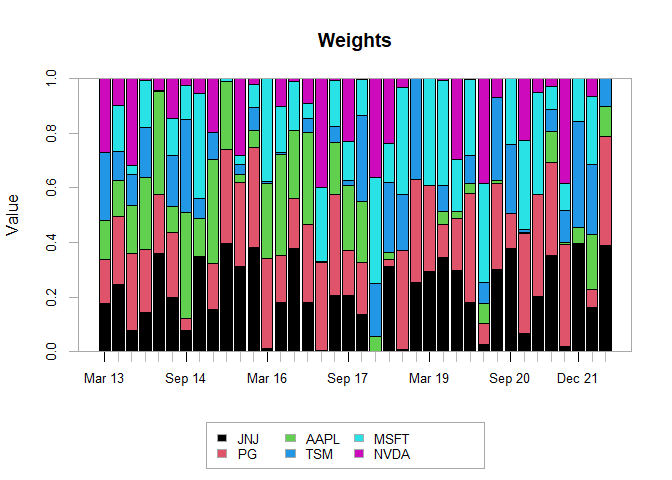

Basic Portfolio Optimization, Re-balancing and Back-Testing in R
================

-   [1 Introduction](#1-introduction)
-   [2 Packages Required](#2-packages-required)
-   [3 Getting To Know Some Useful
    Functions](#3-getting-to-know-some-useful-functions)
    -   [3.1 Retrieving Historical Price
        Data](#31-retrieving-historical-price-data)
    -   [3.2 Calculating Daily Returns and Plotting Cumulative
        Returns](#32-calculating-daily-returns-and-plotting-cumulative-returns)
-   [4 Building a Portfolio With 2 or More
    Securities](#4-building-a-portfolio-with-2-or-more-securities)
    -   [4.1 Import Historical Data](#41-import-historical-data)
    -   [4.2 Daily Returns of Securities and Portfolio
        Return](#42-daily-returns-of-securities-and-portfolio-return)
    -   [4.3 Comparison With A
        Benchmark](#43-comparison-with-a-benchmark)
-   [5 Portfolio Optimization](#5-portfolio-optimization)
    -   [5.1 Minimizing Variance](#51-minimizing-variance)
    -   [5.2 Maximizing Return](#52-maximizing-return)
    -   [5.3 Comparing Portfolios and Performance Against Market
        Benchmark](#53-comparing-portfolios-and-performance-against-market-benchmark)
-   [6 Back-Testing Optimization
    Strategy](#6-back-testing-optimization-strategy)
-   [7 Final Remarks](#7-final-remarks)

# 1 Introduction

Through this project, my intention is to apply what I have learnt in R
onto one of the areas that I always had an interest in, which is stock
portfolio optimization. It documents the commonly used packages and
functions in R that are useful for portfolio analysis and possibly even
for back-testing. It is not intended to be a detailed or advanced guide
to portfolio theory and R application.

The first part starts off with understanding some basic functions in the
relevant packages, which would include importing stock prices from Yahoo
Finance to calculating returns and important metrics, such as Beta and
Sharpe Ratio. The second part would involve tools that we can use for
single-period optimization and optimization with periodic re-balancing.

# 2 Packages Required

``` r
#Use install.packages() or go to the Packages panel to install packages if they have not been installed
library(quantmod)
library(PerformanceAnalytics)
library(PortfolioAnalytics)
library(ROI)
library(ROI.plugin.glpk)
library(ROI.plugin.quadprog)
library(dplyr)
```

# 3 Getting To Know Some Useful Functions

## 3.1 Retrieving Historical Price Data

The **`getSymbols`** function allows us to retrieve historical price
data from sources such as Yahoo Finance and FRED. For this project,
since we are dealing with portfolio optimization, I have retrieved the
stock price data of Amazon (AMZN) from Yahoo Finance. Data can be
retrieved for any stock that has a ticker listed in Yahoo Finance.

``` r
AMZN <- getSymbols(Symbols = "AMZN",
                   src = "yahoo",
                   # Can instead choose "weekly" or "monthly" to import weekly or monthly price data
                   periodicity = "daily",
                   auto.assign = F)
```

Let us get some details about the object `AMZN`.

``` r
head(AMZN, n = 4)
```

    ##            AMZN.Open AMZN.High AMZN.Low AMZN.Close AMZN.Volume AMZN.Adjusted
    ## 2007-01-03     38.68     39.06    38.05      38.70    12405100         38.70
    ## 2007-01-04     38.59     39.14    38.26      38.90     6318400         38.90
    ## 2007-01-05     38.72     38.79    37.60      38.37     6619700         38.37
    ## 2007-01-08     38.22     38.31    37.17      37.50     6783000         37.50

``` r
tail(AMZN, n = 4)
```

    ##            AMZN.Open AMZN.High AMZN.Low AMZN.Close AMZN.Volume AMZN.Adjusted
    ## 2022-05-24   2080.50   2108.00  2025.20    2082.00     5146700       2082.00
    ## 2022-05-25   2073.11   2163.50  2073.00    2135.50     4656000       2135.50
    ## 2022-05-26   2159.40   2253.31  2149.07    2221.55     4650100       2221.55
    ## 2022-05-27   2271.00   2303.74  2252.56    2302.93     4675800       2302.93

``` r
colSums(is.na(AMZN))
```

    ##     AMZN.Open     AMZN.High      AMZN.Low    AMZN.Close   AMZN.Volume 
    ##             0             0             0             0             0 
    ## AMZN.Adjusted 
    ##             0

`AMZN` contains the Opening Prices, High and Low Prices, Closing Prices,
Volume and Adjusted Closing Prices of each day. It ranges from 03
January 2007 (the earliest date for which data can be imported) to 27
May 2022 (the most recent date when this was written). The **`colSums`**
function can be used to find if there are any `NA` rows, which
represents missing data, in the columns.

## 3.2 Calculating Daily Returns and Plotting Cumulative Returns

The Adjusted Price column will be most useful for our analysis in
general as it has been adjusted for splits and dividends. I have subset
that column into a new object called `AMZN.Adj`, calculate the discrete
return of the stock and plot its cumulative returns over time.

``` r
AMZN.Adj <- AMZN[,6]

# na.omit() removes the first row, which is an NA value as there are no prior data to calculate returns
AMZN_Returns <- na.omit(Return.calculate(AMZN.Adj, method = "discrete"))
# We could use Return.calculate(AMZN.Adj, method = "log") to calculate the log return instead.

chart.CumReturns(AMZN_Returns, 
                 legend.loc = "topleft",
                 # Could specify geometric = F to use simple/arithmetic return when using log returns in the previous step
                 geometric = T,
                 main = "Cumulative Daily Return of Amazon")
```


To make interpretation easier, I have opted to use discrete returns in
the **`Return.calculate`** function and geometric chaining in the
**`chart.CumReturns`** function. For continuous compounding, log returns
can be used instead, which can be added across time and
simple/arithmetic chaining should be chosen instead of geometric
chaining. However, log returns cannot be added across securities in a
portfolio, which is another reason for choosing discrete returns.

# 4 Building a Portfolio With 2 or More Securities

Now that we have an understanding of how to import stock prices and
calculate returns, we can start to create a portfolio with more stocks.
Firstly, we can create a vector of the stock tickers that we are
interested in analyzing and adding to our portfolio.

``` r
tickers <- c("JNJ", "PG", "AAPL", "TSM", "MSFT", "NVDA")
```

## 4.1 Import Historical Data

I have created an empty object called `price_data` which will be used to
aggregate the stock price data we will be importing. I had also
indicated a start and end date for the period which data will be
collected. We can also subset the Adjusted Closing Price column when we
import the price data to simplify the work.

``` r
price_data <- NULL

startdate <- "2012-01-01"
enddate <- "2022-05-23"

for (ticker in tickers) {
  price_data <- cbind(price_data,
                      getSymbols(ticker, 
                                 src = "yahoo",
                                 from = startdate, to = enddate, 
                                 periodicity = "daily", auto.assign = F)[,6])
}

colnames(price_data) <- tickers
```

Let us see some details about the object `price_data`.

``` r
head(price_data, n = 4)
```

    ##                 JNJ       PG     AAPL      TSM     MSFT     NVDA
    ## 2012-01-03 49.02984 48.87630 12.55747 9.683946 21.57289 3.223773
    ## 2012-01-04 48.73214 48.85436 12.62495 9.596309 22.08058 3.260512
    ## 2012-01-05 48.67262 48.64957 12.76511 9.683946 22.30622 3.377614
    ## 2012-01-06 48.24840 48.53256 12.89855 9.603610 22.65274 3.338580

``` r
tail(price_data, n = 4)
```

    ##                 JNJ     PG   AAPL   TSM   MSFT   NVDA
    ## 2022-05-17 177.6783 154.68 149.24 93.32 266.20 181.77
    ## 2022-05-18 174.3795 145.04 140.82 90.53 254.08 169.38
    ## 2022-05-19 172.8294 141.70 137.35 90.21 253.14 171.24
    ## 2022-05-20 175.8500 141.79 137.59 90.78 252.56 166.94

``` r
nrow(price_data)
```

    ## [1] 2614

``` r
colSums(is.na(price_data))
```

    ##  JNJ   PG AAPL  TSM MSFT NVDA 
    ##    0    0    0    0    0    0

The **`nrow`** function returns us the number of rows, representing the
number of data points of each stock, and **`colSums`** shows us that
there are no missing data in any of the columns.

## 4.2 Daily Returns of Securities and Portfolio Return

Based on most textbooks on portfolio theory, the calculation of
portfolio return is:


where

is the return of security
.

Therefore, we need to calculate the discrete returns of the securities.

``` r
returns <- na.omit(Return.calculate(price_data, method = "discrete"))
```

Subsequently, we can use the individual security returns in `returns` to
calculate the portfolio’s daily returns. Using the
**`Return.portfolio`** function, we input `returns` and indicate to use
geometric chaining to calculate portfolio return. There is an option to
specify a vector of desired weights for the individual securities and
leaving it out uses an equal weight as the default

To view the object `r_noRebal` we have to use the **`lapply`** function
as the object is a list, and due to the size of the output, I have
indicated to show only the first four rows.

``` r
r_noRebal <- Return.portfolio(returns,
                              geometric = T,
                              verbose = T)

colnames(r_noRebal$returns) <- "Rp_noRebal"

lapply(r_noRebal, head, n = 4)
```

    ## $returns
    ##               Rp_noRebal
    ## 2012-01-04  0.0041222843
    ## 2012-01-05  0.0102230556
    ## 2012-01-06 -0.0007822218
    ## 2012-01-09  0.0012501095
    ## 
    ## $contribution
    ##                      JNJ            PG          AAPL          TSM         MSFT
    ## 2012-01-04 -0.0010119755 -7.479767e-05  0.0008956424 -0.001508287  0.003922323
    ## 2012-01-05 -0.0002014985 -6.954675e-04  0.0018526372  0.001502095  0.001736058
    ## 2012-01-06 -0.0014215837 -3.933480e-04  0.0017459905 -0.001363022  0.002639147
    ## 2012-01-09  0.0002495857  6.889585e-04 -0.0002679227  0.002852164 -0.002272676
    ##                    NVDA
    ## 2012-01-04  0.001899379
    ## 2012-01-05  0.006029232
    ## 2012-01-06 -0.001989406
    ## 2012-01-09  0.000000000
    ## 
    ## $BOP.Weight
    ##                  JNJ        PG      AAPL       TSM      MSFT      NVDA
    ## 2012-01-04 0.1666667 0.1666667 0.1666667 0.1666667 0.1666667 0.1666667
    ## 2012-01-05 0.1649746 0.1659079 0.1668744 0.1644803 0.1698887 0.1678740
    ## 2012-01-06 0.1631057 0.1635406 0.1670196 0.1643028 0.1698879 0.1721434
    ## 2012-01-09 0.1618107 0.1632750 0.1688977 0.1630673 0.1726622 0.1702872
    ## 
    ## $EOP.Weight
    ##                  JNJ        PG      AAPL       TSM      MSFT      NVDA
    ## 2012-01-04 0.1649746 0.1659079 0.1668744 0.1644803 0.1698887 0.1678740
    ## 2012-01-05 0.1631057 0.1635406 0.1670196 0.1643028 0.1698879 0.1721434
    ## 2012-01-06 0.1618107 0.1632750 0.1688977 0.1630673 0.1726622 0.1702872
    ## 2012-01-09 0.1618579 0.1637592 0.1684192 0.1657123 0.1701767 0.1700746
    ## 
    ## $BOP.Value
    ##                  JNJ        PG      AAPL       TSM      MSFT      NVDA
    ## 2012-01-04 0.1666667 0.1666667 0.1666667 0.1666667 0.1666667 0.1666667
    ## 2012-01-05 0.1656547 0.1665919 0.1675623 0.1651584 0.1705890 0.1685660
    ## 2012-01-06 0.1654524 0.1658935 0.1694226 0.1666667 0.1723322 0.1746201
    ## 2012-01-09 0.1640103 0.1654945 0.1711937 0.1652840 0.1750093 0.1726021
    ## 
    ## $EOP.Value
    ##                  JNJ        PG      AAPL       TSM      MSFT      NVDA
    ## 2012-01-04 0.1656547 0.1665919 0.1675623 0.1651584 0.1705890 0.1685660
    ## 2012-01-05 0.1654524 0.1658935 0.1694226 0.1666667 0.1723322 0.1746201
    ## 2012-01-06 0.1640103 0.1654945 0.1711937 0.1652840 0.1750093 0.1726021
    ## 2012-01-09 0.1642633 0.1661929 0.1709221 0.1681750 0.1727058 0.1726021

An awesome feature of this function is that we can input re-balancing
periods, which can be monthly, quarterly, or yearly. If
**`rebalance_on`** was left out, the default assumes a buy-and-hold
strategy (no re-balancing), and you may experiment with this based on
your investing preferences.

``` r
r_withRebal <- Return.portfolio(returns, 
                                geometric = T, 
                                rebalance_on = "quarters", 
                                verbose = T)

colnames(r_withRebal$returns) <- "Rp_withRebal"
```

Indicating **`verbose = T`** allows us to extract more details about the
underlying portfolio return calculation, such as the weights at the
beginning and end of periods. We take a look at how the end-of-period
weight for `JNJ` changes when the portfolio is re-balanced versus when
it is not re-balanced. We can also use the
**`charts.PerformanceSummary`** function to compare the cumulative
return of the portfolios with re-balancing and without re-balancing.

``` r
eop_weight_noRebal <- r_noRebal$EOP.Weight

eop_weight_wRebal <- r_withRebal$EOP.Weight

  par(mfrow = c(2,1), mar = c(2, 4, 2, 2))

  plot.zoo(eop_weight_wRebal$JNJ, 
           main = "JNJ End-of-Period Weights Over Time",
           ylab = "With Rebalancing")
           
  abline(h = 1/length(colnames(eop_weight_wRebal)), col = "red", lwd = 2)

  plot.zoo(eop_weight_noRebal$JNJ,
          ylab = "Without Rebalancing")
  
  abline(h = 1/length(colnames(eop_weight_wRebal)), col = "red", lwd = 2)
```


``` r
ret_comp <- cbind(r_noRebal$returns, r_withRebal$returns)

charts.PerformanceSummary(R = ret_comp,
                          main = "Comparison of Cumulative Returns",
                          legend.loc = "topleft")
```


For the weights, we can see the when we re-balance the portfolio
quarterly, the end-of-period weights tend to fluctuate around the weight
of approximately 17% (which is the weight in the equal weight
portfolio). The weight without re-balancing showed a decreasing trend
and we can uncover why this happened. Weight of `NVDA` had increased
drastically over time as the stock’s value grew faster in that span of
time compared to other stocks

``` r
par(mfrow = c(1,1), mar = c(2, 2, 2, 2))

plot.zoo(eop_weight_noRebal,
         main = "End-of-Period Weights Over Time Without Rebalancing")
```


We can compare the statistics of this two portfolios using
**`table.stats`** function. We can see that re-balancing reduced
standard deviation but has also slightly reduced returns (values are
based on daily returns).

``` r
table.Stats(ret_comp)
```

    ##                 Rp_noRebal Rp_withRebal
    ## Observations     2613.0000    2613.0000
    ## NAs                 0.0000       0.0000
    ## Minimum            -0.1496      -0.1188
    ## Quartile 1         -0.0058      -0.0045
    ## Median              0.0014       0.0013
    ## Arithmetic Mean     0.0012       0.0010
    ## Geometric Mean      0.0010       0.0009
    ## Quartile 3          0.0088       0.0073
    ## Maximum             0.1251       0.1067
    ## SE Mean             0.0003       0.0002
    ## LCL Mean (0.95)     0.0005       0.0005
    ## UCL Mean (0.95)     0.0018       0.0015
    ## Variance            0.0003       0.0002
    ## Stdev               0.0170       0.0124
    ## Skewness           -0.1826      -0.1584
    ## Kurtosis            7.6682      10.2691

## 4.3 Comparison With A Benchmark

We may also wish to compare our portfolios against a benchmark that is
relevant to the portfolio we created. In this example, I have added
large-cap U.S. stocks into my portfolio and so my benchmark would be the
S&P500 index (ticker: SPY)

``` r
benchmark <- getSymbols("SPY", 
                        src = "yahoo",
                        from = startdate, to = enddate, 
                        periodicity = "daily", auto.assign = F)[,6]

nrow(benchmark)
```

    ## [1] 2614

``` r
colSums(is.na(benchmark))
```

    ## SPY.Adjusted 
    ##            0

``` r
benchmarkReturn <- na.omit(Return.calculate(benchmark, method = "discrete")) %>%
  `colnames<-`("SPY")
```

With the benchmark return, we can calculate the portfolios’ betas and
the alphas using the functions **`CAPM.beta`** and
**`CAPM.jensenAlpha`**. These functions have an optional input for the
risk-free rate, which I had assumed to be 3% and since we are dealing
with daily returns, we need to divide by 252 trading days. Other metrics
that might be of interest are the Sharpe, Information, and Treynor
Ratios.

``` r
perfMetrics <- round(rbind(CAPM.beta(ret_comp, benchmarkReturn, Rf = 0.03/252),
                           CAPM.alpha(ret_comp, benchmarkReturn, Rf = 0.03/252),
                           SharpeRatio(ret_comp, Rf = 0.03/252, FUN = "StdDev"),
                           TreynorRatio(ret_comp, benchmarkReturn, Rf = 0.03/252),
                           InformationRatio(ret_comp, benchmarkReturn)), digits = 4
)

perfMetrics
```

    ##                               Rp_noRebal Rp_withRebal
    ## Beta: SPY                         1.2705       1.0314
    ## Alpha: SPY                        0.0005       0.0004
    ## StdDev Sharpe (Rf=0%, p=95%):     0.0627       0.0723
    ## Treynor Ratio: SPY                0.2051       0.2214
    ## Information Ratio: SPY            0.9366       1.3389

The **`table.AnnualizeReturns`** function can be used to find the
annualized return, standard deviation, and Sharpe ratio.

``` r
cbind(table.AnnualizedReturns(ret_comp, Rf = 0.03/252),
      table.AnnualizedReturns(benchmarkReturn, Rf = 0.03/252))
```

    ##                           Rp_noRebal Rp_withRebal    SPY
    ## Annualized Return             0.2989       0.2657 0.1349
    ## Annualized Std Dev            0.2694       0.1961 0.1649
    ## Annualized Sharpe (Rf=3%)     0.9671       1.1646 0.6145

For those who are interested in the breakdown of returns by months in
each year, the function **`table.CalendarReturns`** can be used.

``` r
table.CalendarReturns(benchmarkReturn)
```

    ##       Jan  Feb  Mar  Apr  May  Jun  Jul  Aug  Sep  Oct  Nov  Dec  SPY
    ## 2012  0.0 -0.4  0.4 -0.4 -0.2  2.5 -0.7  0.5 -0.5  0.0  0.0  1.7  2.9
    ## 2013 -0.2 -0.2  0.3  0.2 -1.4 -0.4  0.1 -0.3 -0.5 -0.3 -0.1  0.5 -2.4
    ## 2014 -0.6  0.3  0.8  0.3  0.2 -0.1 -2.0  0.3 -0.3  1.1 -0.2 -1.0 -1.2
    ## 2015 -1.3 -0.3 -0.9 -1.0 -0.6  0.2 -0.2 -0.8  1.9 -0.4 -0.4 -1.0 -4.8
    ## 2016  2.4 -0.8 -0.2 -0.5 -0.2  1.4  0.2 -0.3  0.8  0.0 -0.2 -0.4  2.0
    ## 2017  0.0 -0.3 -0.2 -0.2  0.0  0.2 -0.1  0.6  0.4  0.2  0.9 -0.4  1.0
    ## 2018  0.0 -1.0  1.3 -0.8 -0.6  0.1  0.5  0.0  0.0  1.1  0.6  0.9  2.1
    ## 2019  0.9 -0.2  0.6  0.1 -1.3  0.5 -1.1  0.0  0.5 -0.3 -0.4  0.2 -0.6
    ## 2020 -1.8 -0.4 -1.5 -0.9  0.4  1.3  0.8 -0.4  0.8 -1.0 -0.4  0.5 -2.7
    ## 2021 -2.0 -0.5  0.4 -0.7  0.2  0.1 -0.5 -0.1 -1.2  0.2 -1.9 -0.3 -6.2
    ## 2022  1.8 -0.3 -1.5 -3.7  0.0   NA   NA   NA   NA   NA   NA   NA -3.7

# 5 Portfolio Optimization

In Section 4, I had assumed that weights were given (using the default
option to calculate the returns of an equal weight portfolio). In this
part, we are going to optimize the weight of the stocks in our portfolio
based on certain objectives.

## 5.1 Minimizing Variance

Before we begin with the optimization, we need to create a list of
constraints and objectives for our portfolio specification. To do so, we
need to use the **`portfolio.spec`** function before adding constrains
or objectives using **`add.constraint`** or **`add.objective`**.

``` r
portspec1 <- portfolio.spec(colnames(returns))

# Sum of weights constrained to 1, can also specify as type = "full investment"
portspec1 <- add.constraint(portspec1, 
                            type = "weight_sum", 
                            min_sum = 1, max_sum = 1)

# Weight constraint on each stock, max is 35% of portfolio
portspec1 <- add.constraint(portspec1, 
                            type="box",
                            min=0, max=0.35)

# Objective to minimize risk based on variance (function will default to standard deviation as measure of risk)
portspec1 <- add.objective(portspec1,
                           type = "risk",
                           name = "var")
```

After indicating our desired constraints and objectives, we can proceed
to use the function **`optimize.portfolio`** to calculate the optimal
weights that minimizes variance. **`optimize.portfolio`** uses different
types of solvers to calculate the optimal weight, and since minimizing
variance is a quadratic optimization problem, we use the **`quadprog`**
solver from the **`ROI.plugin.quadprog`**. We can instead indicate
**`ROI`** which automatically chooses between **`glpk`** or
**`quadprog`** solvers based on whether it is a linear or quadratic
optimization problem.

``` r
port_MV <- optimize.portfolio(returns, 
                              portspec1,
                              optimize_method = "quadprog",
                              # Indicating "trace = T" allows us to use 
                              # additional information in the later parts
                              trace = T)

port_MV
```

    ## ***********************************
    ## PortfolioAnalytics Optimization
    ## ***********************************
    ## 
    ## Call:
    ## optimize.portfolio(R = returns, portfolio = portspec1, optimize_method = "quadprog", 
    ##     trace = T)
    ## 
    ## Optimal Weights:
    ##    JNJ     PG   AAPL    TSM   MSFT   NVDA 
    ## 0.3500 0.3500 0.0773 0.1426 0.0800 0.0000 
    ## 
    ## Objective Measure:
    ##   StdDev 
    ## 0.009587

## 5.2 Maximizing Return

This time, I am optimizing for the other extreme case, which maximizes
returns of the portfolio. The steps are similar to those used in Section
5.1, except for a change in the objective and the type of solver used.
Since maximizing return is a linear optimization problem, we can use the
**`glpk`** solver, or simply indicate **`ROI`**.

``` r
portspec2 <- portfolio.spec(colnames(returns))

# We use the same constraints as in Case 1
portspec2 <- add.constraint(portspec2, 
                            type = "weight_sum", 
                            min_sum = 1, max_sum = 1)

portspec2 <- add.constraint(portspec2, 
                            type="box", 
                            min=0, max=0.35)

# Objective to maximize return based on mean return
portspec2 <- add.objective(portspec2,
                           type = "return",
                           name = "mean")
```

``` r
port_MR <- optimize.portfolio(returns, 
                              portspec2,
                              optimize_method = "glpk",
                              trace = T)

port_MR
```

    ## ***********************************
    ## PortfolioAnalytics Optimization
    ## ***********************************
    ## 
    ## Call:
    ## optimize.portfolio(R = returns, portfolio = portspec2, optimize_method = "glpk", 
    ##     trace = T)
    ## 
    ## Optimal Weights:
    ##  JNJ   PG AAPL  TSM MSFT NVDA 
    ## 0.00 0.00 0.35 0.00 0.30 0.35 
    ## 
    ## Objective Measure:
    ##     mean 
    ## 0.001352

## 5.3 Comparing Portfolios and Performance Against Market Benchmark

To compare the portfolios, we need to extract the optimal weights that
had been calculated in the previous steps and calculate the portfolio
returns. I have created a bar chart to show how the weights differ in
each portfolio for illustration.

``` r
weight_MV <- extractWeights(port_MV)

weight_MR <- extractWeights(port_MR)

par(mfrow = c(2,1), mar = c(2, 4, 2, 2))

barplot(weight_MV, 
        main = "Weights in Different Portfolios",
        ylab = "Portfolio MV")

barplot(weight_MR,
        ylab = "Portfolio MR")
```


With the weights, we can calculate the daily returns of the different
portfolio using the **`Return.portfolio`** function. I have included the
re-balancing periodicity, but you may choose to leave it out or change
to months or years depending on your preference.

``` r
rp_MV <- Return.portfolio(returns, 
                          weights = weight_MV,
                          rebalance_on = "quarters",
                          geometric = T) %>%
  `colnames<-`("Portfolio MV")

rp_MR <- Return.portfolio(returns, 
                          weights = weight_MR,
                          rebalance_on = "quarters",
                          geometric = T) %>%
  `colnames<-`("Portfolio MR")
```

With the portfolio returns, we can compare the how the portfolios
performed against the market benchmark. I have included a chart of
cumulative returns and some statistics and metrics as I had done in
Section 4.

``` r
comparison <- cbind(rp_MV, rp_MR, benchmarkReturn)

charts.PerformanceSummary(comparison,
                          main = "Comparing Performance of Portfolios",
                          legend.loc = "topleft")
```


``` r
table.Stats(comparison)
```

    ##                 Portfolio.MV Portfolio.MR       SPY
    ## Observations       2613.0000    2613.0000 2613.0000
    ## NAs                   0.0000       0.0000    0.0000
    ## Minimum              -0.0779      -0.1545   -0.1094
    ## Quartile 1           -0.0035      -0.0064   -0.0034
    ## Median                0.0008       0.0017    0.0007
    ## Arithmetic Mean       0.0007       0.0014    0.0006
    ## Geometric Mean        0.0006       0.0012    0.0005
    ## Quartile 3            0.0053       0.0098    0.0054
    ## Maximum               0.0976       0.1242    0.0906
    ## SE Mean               0.0002       0.0003    0.0002
    ## LCL Mean (0.95)       0.0003       0.0007    0.0002
    ## UCL Mean (0.95)       0.0010       0.0020    0.0010
    ## Variance              0.0001       0.0003    0.0001
    ## Stdev                 0.0096       0.0172    0.0104
    ## Skewness              0.1466      -0.1916   -0.6737
    ## Kurtosis             13.6426       7.3165   15.7952

``` r
table.AnnualizedReturns(comparison, 0.03/252, scale = 252)
```

    ##                           Portfolio.MV Portfolio.MR    SPY
    ## Annualized Return               0.1684       0.3571 0.1349
    ## Annualized Std Dev              0.1525       0.2728 0.1649
    ## Annualized Sharpe (Rf=3%)       0.8781       1.1622 0.6145

# 6 Back-Testing Optimization Strategy

Let us create a new portfolio specification that follows the
mean-variance portfolio theory for the back-testing.

``` r
portspec3 <- portfolio.spec(colnames(returns))

# Slight change in weight_sum to reduce restrictiveness while optimizing
portspec3 <- add.constraint(portspec3, 
                            type = "weight_sum",
                            min_sum=0.99, max_sum=1.01)

portspec3 <- add.constraint(portspec3, 
                            type="box", 
                            min=0, max=0.4)

# Add a constraint to have a target return
portspec3 <- add.constraint(portspec3,
                            type = "return",
                            return_target = 0.15/252)

# Include transaction cost, assumed to be 2%
portspec3 <- add.constraint(portspec3,
                            type = "transaction_cost",
                            ptc = 0.02)

# Adding a return objective, thus we maximize mean return per unit of risk
portspec3 <- add.objective(portspec3,
                           type = "return",
                           name = "mean")

portspec3 <- add.objective(portspec3,
                           type = "risk",
                           name = "var")
```

The **`PortfolioAnalytics`** package provides a handy function called
**`optimize.portfolio.rebalancing`** which can provide back-testing
capabilities. It is similar to the function **`optimize.portfolio`** but
has requires other inputs. To do back-testing, we need to input the
training period for when the portfolio will be optimized, and the
rolling window which rolls over historical data. For this part, I will
be using the random portfolios solver and in order to do so, I will
first generate a matrix of random portfolios. This will then be fed to
the optimization function to prevent recalculation. A larger number of
random portfolios (till a certain number) tend to lead to better
optimization results but will also require more time for calculation.

``` r
randport <- random_portfolios(portfolio = portspec3,
                              permutations = 20000,
                              rp_method = "simplex")
```

    ## Warning: executing %dopar% sequentially: no parallel backend registered

``` r
port_MeanVar_qRebal <- optimize.portfolio.rebalancing(returns,
                                                      portspec3,
                                                      optimize_method = "random",
                                                      rebalance_on = "quarters",
                                                      # max Sharpe ratio 
                                                      maxSR = T,
                                                      rp = randport,
                                                      search_size = 5000,
                                                      training_period = 252,
                                                      rolling_window = 45,
                                                      trace = T)
```

I have generated the `randport` first so that the
**`optimize.portfolio.rebalancing`** function does not recalculate these
portfolios. Since our data is in daily periods, I have used 252 days as
the optimization period for the portfolio for which weights are
calculated, and this historical data rolls forward by 45 days each time.
We can take a look at how the weights changed over time by using the
**`chart.Weights`** function.

``` r
chart.Weights(port_MeanVar_qRebal)
```



We can proceed to calculate the portfolio returns using the functions
**`Return.portfolio`**.

``` r
w_qOptim <- extractWeights(port_MeanVar_qRebal)

rp_MeanVar <- Return.portfolio(returns, 
                               weights = w_qOptim, 
                               geometric = T)
```

Lastly, we can visualize the performance of this portfolio by plotting
its cumulative returns and compare it against the market benchmark.

``` r
evaluation <- cbind(rp_MeanVar,benchmarkReturn)

charts.PerformanceSummary(evaluation, Rf=0.03/252)
```


``` r
table.AnnualizedReturns(evaluation, Rf=0.03/252)
```

    ##                           portfolio.returns    SPY
    ## Annualized Return                    0.2720 0.1349
    ## Annualized Std Dev                   0.1960 0.1649
    ## Annualized Sharpe (Rf=3%)            1.1959 0.6145

# 7 Final Remarks

This project serves to apply what I have learnt in R to portfolio
optimization. It documents the functions and packages that are used and
how to create interesting visualizations of portfolio performance. While
optimization and back-testing is a useful and important concept, it is
critical to note that past performance of stocks should not be used to
indicate future performance. It only serves to test how certain
investment strategies performed based on historical data and whether it
would suit an investor’s preferences.
